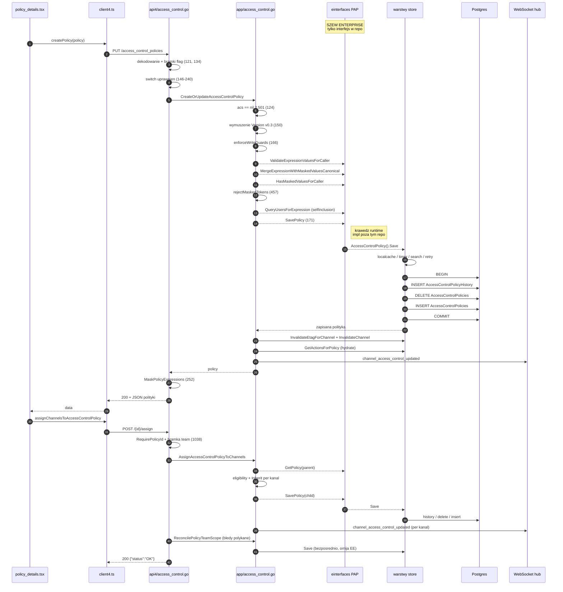

# Research: ABAC — przepływ zapisu i przypisania polityki (SAVE + ASSIGN)

**Data**: 2026-09-10T11:29:24+02:00
**Badacz**: Sebastian Urbański
**Commit**: `87168644a4` (`87168644a48fa66f0229a64d1706a3223c465cea`)
**Branch**: `master` (== `origin/master`)
**Repozytorium**: mattermost

---

## Pytanie badawcze

Prześledzić jeden przepływ klastra ABAC end-to-end — od entry pointu, przez warstwy, do zapisu/odczytu i z powrotem — ze szczególną uwagą na obszary wskazane w [repo-map.md](context/map/repo-map.md). Trzy osie: (1) trace e2e z `file:line` i diagramem, (2) pokrycie testami i luki, (3) blast radius łączący graf statyczny ze współzmiennością z historii gita. Wyłącznie opis stanu obecnego — bez propozycji zmian.

**Wybrany przepływ:** zapis polityki + przypisanie do kanałów (`PUT /api/v4/access_control_policies` oraz `POST /api/v4/access_control_policies/{id}/assign`). Wybrany, bo pokrywa entry point z notatki wstępnej ([app/access_control.go:123](server/channels/app/access_control.go#L123)) i daje pełny przekrój write-path przez wszystkie warstwy wskazane w mapie.

**Metoda:** trzy równoległe sub-agenty (trace / testy / blast radius), plus własna weryfikacja twierdzeń newralgicznych. Rozbieżności między agentami a mapą repo rozstrzygnięte pomiarem — zaznaczone w §4.3.

---

## Summary

Przepływ jest kompletny i szczelny **po stronie strażników** (guardy zapisu, masking, self-inclusion, walidacja), ale trzyma się na trzech kruchych założeniach:

1. **Silnik decyzyjny nie istnieje w tym repozytorium.** `AccessControlServiceInterface` to czysty szew — 20 metod bez implementacji. Cała logika CEL, masking i PDP siedzi w prywatnym module `github.com/mattermost/enterprise/access_control`. W buildzie OSS `acs == nil` i każdy entry point zwraca **501**. Zmiana sygnatury w [einterfaces/pap.go](server/einterfaces/pap.go) kompiluje się tu bez błędu i przechodzi wszystkie testy — pęka dopiero w repo, którego to CI nie buduje.

2. **Testy Go weryfikują okablowanie, nie semantykę.** Wszystkie testy write-path wyłączają `AttributeValueMasking`, które w produkcji domyślnie jest **włączone** ([feature_flags.go:181](server/public/model/feature_flags.go#L181)). Gałąź `mergeFromStore=true` — ta, która wykonuje się przy **każdym realnym zapisie** z Admin Console i Channel Settings — nie ma żadnego pokrycia integracyjnego. Faktyczną siatką bezpieczeństwa jest 6 testów Playwright, wymagających licencjonowanego serwera enterprise.

3. **Kontrakt REST ma nie trzy, a cztery ręcznie utrzymywane kopie**, i wszystkie są rozjechane. Opublikowana specyfikacja OpenAPI dla `AccessControlPolicy` jest **fikcją**: dokumentuje 6 pól, które nie istnieją, pomija 10, które istnieją, i nie ma w ogóle schematu reguły — czyli tego, co niesie wyrażenie CEL, właściwy ładunek endpointu SAVE. Czwarta kopia to `accessControlPolicyV0_1` w sqlstore — struktura decydująca, co faktycznie wyląduje w kolumnie `Data jsonb`.

Dwa rozjazdy Go↔TS są **żywymi defektami, nie tylko gniciem dokumentacji**: pole `create_at`/`created_at` (webapp czyta pole, którego serwer nigdy nie wysyła) i typ `props` (webapp obchodzi własny typ podwójnym rzutowaniem).

Slice jest gorący: 30 z 37 commitów `app/access_control.go` z ostatnich 12 miesięcy przypada na ostatnie 6. Trzy równoległe strumienie prac są w locie **teraz**.

> **Aktualizacja po weryfikacji strukturalnej (ast-grep, §9).** Trzy tezy powyżej przetrwały pomiar, ale przegląd wykrył **czwarte, nieopisane wcześniej ustalenie**: `PUT /access_control_policies` **nie jest jedyną ścieżką zapisu**. Równoległa ścieżka biegnie przez Plugin API (`SavePluginAccessControlPolicy`, [plugin_access_control.go:170](server/channels/app/plugin_access_control.go#L170)), wchodzi w tych samych strażników — ale z `mergeFromStore=false`, więc **omija merge zamaskowanych wyrażeń i strażnika `masked_rule_deleted`** — i wymusza `Version = v0.5`, nie `v0.3`. Szczegóły: §9.4.

---

# 1. Feature overview

## 1.1 Czym jest ten przepływ

ABAC (Attribute-Based Access Control) pozwala administratorowi zdefiniować politykę dostępu jako **wyrażenie CEL** nad atrybutami użytkownika (CPA — Custom Profile Attributes) i przypiąć ją do kanałów lub zespołów. Badany przepływ to ścieżka **zapisu**: utworzenie/edycja polityki oraz przypisanie jej do zasobów.

**Kluczowa obserwacja architektoniczna [EVIDENCE]:** SAVE i ASSIGN to **dwa niezależne round-tripy HTTP**. Webapp wywołuje je sekwencyjnie z jednego przycisku „Save" ([policy_details.tsx:277](webapp/channels/src/components/admin_console/access_control/policy_details/policy_details.tsx#L277), potem [:318](webapp/channels/src/components/admin_console/access_control/policy_details/policy_details.tsx#L318)), ale **po stronie serwera nie ma transakcji spinającej te operacje**. Pełny zapis z Admin Console to w istocie **pięć osobnych żądań** (create → unassign → assign → set-active → create-sync-job), bez rollbacku.

## 1.2 Warstwy i entry pointy

| Warstwa | Plik | Rola |
|---|---|---|
| UI (parent) | [policy_details.tsx:270](webapp/channels/src/components/admin_console/access_control/policy_details/policy_details.tsx#L270) | edytor polityki nadrzędnej w System Console |
| UI (channel) | [channel_details.tsx:783](webapp/channels/src/components/admin_console/team_channel_settings/channel/details/channel_details.tsx#L783) | wariant polityki kanałowej |
| Redux | [actions/access_control.ts:24](webapp/channels/src/packages/mattermost-redux/src/actions/access_control.ts#L24) | thunk (nie `bindClientFunc` — obiekt błędu przeżywa) |
| Klient HTTP | [client4.ts:5078](webapp/platform/client/src/client4.ts#L5078) | `updateOrCreateAccessControlPolicy` |
| Routing | [api4/api.go:414](server/channels/api4/api.go#L414) | `InitAccessControlPolicy()` — **bez bramki** |
| Handler | [api4/access_control.go:114](server/channels/api4/access_control.go#L114) | `createAccessControlPolicy` |
| App | [app/access_control.go:123](server/channels/app/access_control.go#L123) | `CreateOrUpdateAccessControlPolicy` |
| **App (Plugin API)** | [app/plugin_access_control.go:170](server/channels/app/plugin_access_control.go#L170) | `SavePluginAccessControlPolicy` — **druga ścieżka zapisu**, §9.4 |
| Szew EE | [einterfaces/pap.go:39](server/einterfaces/pap.go#L39) | `SavePolicy` — **brak implementacji w repo** |
| Store | [sqlstore/access_control_policy_store.go:188](server/channels/store/sqlstore/access_control_policy_store.go#L188) | `Save` |
| DB | [000134_…up.sql](server/channels/db/migrations/postgres/000134_create_access_control_policies.up.sql) | `AccessControlPolicies` + `…History` |

Stos store od zewnątrz do środka [EVIDENCE, [platform/service.go:311-323](server/channels/app/platform/service.go#L311)]: `localcachelayer` → `timerlayer` → `searchlayer` → `retrylayer` → `sqlstore`.

## 1.3 Sekwencja SAVE — krok po kroku

### Webapp → HTTP

1. [policy_details.tsx:270](webapp/channels/src/components/admin_console/access_control/policy_details/policy_details.tsx#L270) — `handleSubmit(apply)`.
2. [:277-282](webapp/channels/src/components/admin_console/access_control/policy_details/policy_details.tsx#L277) — `createPolicy({id, name, rules, type:'parent'})`. **Nie wysyła `version` ani `active`.**
3. [actions/access_control.ts:24-40](webapp/channels/src/packages/mattermost-redux/src/actions/access_control.ts#L24) — dispatch `CREATE_ACCESS_CONTROL_POLICY_SUCCESS`.
4. [client4.ts:5078-5084](webapp/platform/client/src/client4.ts#L5078) — `PUT {base}/access_control_policies[?team_id=…]`. `team_id` jest **query paramem**, nie polem body.

### API4 — bramki i uprawnienia

5. [api4/api.go:338](server/channels/api4/api.go#L338) — subrouter `/access_control_policies`.
6. [api4/api.go:414](server/channels/api4/api.go#L414) — `InitAccessControlPolicy()` rejestrowany **bezwarunkowo**, bez middleware licencyjnego ani configowego.
7. [access_control.go:48](server/channels/api4/access_control.go#L48) — `PUT "" → createAccessControlPolicy`.
8. [:114-119](server/channels/api4/access_control.go#L114) — dekodowanie body; błąd → 400.
9. [:121-124](server/channels/api4/access_control.go#L121) — **flaga #1**: `type=="permission"` && `!PermissionPolicies` → 501.
10. [:134-137](server/channels/api4/access_control.go#L134) — **flaga #2**: `type=="channel"` && reguła permission && `!IsChannelPermissionPoliciesEnabled()` → 501.
11. [:139-141](server/channels/api4/access_control.go#L139) — audit record; `Auditable()` ([access_policy.go:749](server/public/model/access_policy.go#L749)) loguje tylko `id`/`type`/`revision`.
12. [:146-240](server/channels/api4/access_control.go#L146) — switch uprawnień per typ (pełna lista gałęzi w §1.9), w tym `preserveSystemManagedFields` ([:28](server/channels/api4/access_control.go#L28)) przypinający `Imports`/`Scope`/`ScopeID` ze stanu zapisanego.
13. [:242](server/channels/api4/access_control.go#L242) — `c.App.CreateOrUpdateAccessControlPolicy(...)`.

### App — strażnicy zapisu

14. [app/access_control.go:124-127](server/channels/app/access_control.go#L124) — **`ch.AccessControl == nil` → 501**. To de facto jedyna bramka licencyjna tej ścieżki. [POMIAR §9.2] Ten sam guard występuje **39 razy w `server/`**, w tym 21 razy w samym `access_control.go` — nie jest to pięć entry pointów, tylko konsekwentnie powtórzony kształt.
15. [:150](server/channels/app/access_control.go#L150) — serwer **nadpisuje** `policy.Version = v0.3`, kasując cokolwiek przysłał klient. [POMIAR §9.2] `v0.3` jest wymuszane w **trzech** miejscach ([:150](server/channels/app/access_control.go#L150), [:1594](server/channels/app/access_control.go#L1594), [:1704](server/channels/app/access_control.go#L1704)); ścieżka plugin wymusza natomiast **`v0.5`** ([plugin_access_control.go:202](server/channels/app/plugin_access_control.go#L202)).
16. [:140-148](server/channels/app/access_control.go#L140) — dla `type=="channel"`: `ValidateChannelEligibilityForAccessControl` ([:2347](server/channels/app/access_control.go#L2347)) — odrzuca DM/GM, group-constrained, shared, default channel.
17. [:166](server/channels/app/access_control.go#L166) — `enforceAccessControlPolicyWriteGuards(..., mergeFromStore=true)`. [POMIAR §9.2] Ta funkcja ma **dwa** call-site'y; drugi to [plugin_access_control.go:225](server/channels/app/plugin_access_control.go#L225) z `mergeFromStore=**false**`.
18. [:432](server/channels/app/access_control.go#L432) — **bramka maskingu**; cały blok pomijany, gdy flaga off.
19. [:433-435](server/channels/app/access_control.go#L433) — `callerID == ""` przy maskingu → **401**.
20. [:437-440](server/channels/app/access_control.go#L437) — `newMaskingResolver` ([masking.go:109](server/channels/app/access_control_masking.go#L109)) rozwiązuje grupę CPA `access_control`; błąd → 500.
21. [:446](server/channels/app/access_control.go#L446) — `validatePolicyExpressionValues` → `acs.ValidateExpressionValuesForCaller` **[szew EE]**. Uruchamiany **przed** mergem, więc sprawdza tylko literały przysłane przez wywołującego.
22. [:451](server/channels/app/access_control.go#L451) — `mergeStoredPolicyExpressions` (szczegóły niżej).
23. [:457](server/channels/app/access_control.go#L457) — `rejectMaskedTokens` — wyrażenie wciąż zawierające `"--------"` ([access_control_masking.go:22](server/public/model/access_control_masking.go#L22)) → 400.
24. [:462-466](server/channels/app/access_control.go#L462) — self-inclusion, gdy `callerID != ""` i brak `ManageSystem`. **Uruchamiany niezależnie od flagi maskingu.**
25. [:474-493](server/channels/app/access_control.go#L474) — `checkSelfInclusion` → `QueryUsersForExpression` **[szew EE]** z `Limit=1`.
26. [:171](server/channels/app/access_control.go#L171) — `acs.SavePolicy(rctx, policy)` **[szew EE — dispatch]**.

### Merge zamaskowanych wyrażeń — sedno strażnika

[`mergeStoredPolicyExpressions`, :228-350](server/channels/app/access_control.go#L228):

- [:234-240](server/channels/app/access_control.go#L234) — `acs.GetPolicy`; 404 → `(false, nil)` (nowa polityka, nie ma czego mergować).
- [:248-260](server/channels/app/access_control.go#L248) — indeksowanie reguł zapisanych po `Name`; jedyna anonimowa reguła membership przypinana po akcji (`isMembershipRule`, [:358](server/channels/app/access_control.go#L358)).
- [:298](server/channels/app/access_control.go#L298) — `a.mergeExpressionWithMaskedValues` → wrapper aplikacyjny ([:382](server/channels/app/access_control.go#L382)), który na [:391](server/channels/app/access_control.go#L391) woła `MergeExpressionWithMaskedValuesCanonical` **[szew EE]** — kanoniczny spacer po AST CEL, wstrzykujący z powrotem ukryte literały. [POMIAR §9.2] To **jedyne** wywołanie tej metody EE w całym repo.
- [:308-309](server/channels/app/access_control.go#L308) — jeśli wynik różni się od tego, co przyszło → ukryte wartości zostały wstrzyknięte → **`rule.Actions` ([:308](server/channels/app/access_control.go#L308)) i `rule.Role` ([:309](server/channels/app/access_control.go#L309)) wracają na wartości zapisane**, `mergedHidden = true`.
- [:317-347](server/channels/app/access_control.go#L317) — każda reguła **usunięta** przez wywołującego jest sprawdzana przez `a.expressionHasMaskedValuesForCaller` ([:340](server/channels/app/access_control.go#L340)) → `HasMaskedValuesForCaller` **[szew EE]**; jeśli niosła ukryte wartości → **403** (`saveForbiddenError` [:345](server/channels/app/access_control.go#L345), wewnętrzny powód `masked_rule_deleted`).

To jest zabezpieczenie przed poszerzeniem dostępu przez skasowanie reguły, której się nie widzi.

### Store — delete-and-reinsert, nie UPDATE

27. [sqlstore:189-191](server/channels/store/sqlstore/access_control_policy_store.go#L189) — `policy.IsValid()`.
28. [:193-197](server/channels/store/sqlstore/access_control_policy_store.go#L193) — `Begin()`.
29. [:204-214](server/channels/store/sqlstore/access_control_policy_store.go#L204) — `fromModel` zwija `Imports/Rules/Roles/Scope/ScopeID` w blob `Data jsonb`.
30. [:216-219](server/channels/store/sqlstore/access_control_policy_store.go#L216) — zmiana `Type` → twardy błąd.
31. [:230-250](server/channels/store/sqlstore/access_control_policy_store.go#L230) — **short-circuit no-op**: jeśli bajty `Data` i `Version` bez zmian, aktualizowana jest wyłącznie `Name` — bez bumpu rewizji i bez wpisu historii. **`Props` jest wyłączone z porównania.**
32. [:259-267](server/channels/store/sqlstore/access_control_policy_store.go#L259) — stary wiersz → `AccessControlPolicyHistory`.
33. [:269-272](server/channels/store/sqlstore/access_control_policy_store.go#L269) — `DELETE` z tabeli głównej.
34. [:273-280](server/channels/store/sqlstore/access_control_policy_store.go#L273) — jeśli brak żywego wiersza, sonduje historię, by wskrzeszone ID kontynuowało łańcuch rewizji.
35. [:175-186, :282](server/channels/store/sqlstore/access_control_policy_store.go#L175) — serwer stempluje `CreateAt = GetMillis()` i `Revision = existing+1`. **Wartości klienta są zawsze odrzucane.**
36. [:284-295](server/channels/store/sqlstore/access_control_policy_store.go#L284) — `INSERT`; konflikt na `idx_accesscontrolpolicies_name_type` → `ErrConflict`.
37. [:297-306](server/channels/store/sqlstore/access_control_policy_store.go#L297) — `toModel()` + `Commit()`.

### Powrót — cache, WebSocket, odpowiedź

38. [app:2247](server/channels/app/access_control.go#L2247) — `InvalidateEtagForChannel` → [localcachelayer:48](server/channels/store/localcachelayer/access_control_policy_layer.go#L48), inwalidacja **klastrowa**.
39. [app:2248](server/channels/app/access_control.go#L2248) — `Store().Channel().InvalidateChannel`.
40. [app:2250-2270](server/channels/app/access_control.go#L2250) — `HydrateChannelPolicyActions` ([:2117](server/channels/app/access_control.go#L2117)) → `GetActionsForPolicy` przelicza `policy_actions`.
41. [app:2281-2283](server/channels/app/access_control.go#L2281) — WS `channel_access_control_updated` ([websocket_message.go:91](server/public/model/websocket_message.go#L91)) z payloadem `{channel: <JSON>}`.
42. [api4:252-254](server/channels/api4/access_control.go#L252) — `MaskPolicyExpressions` ([masking.go:846](server/channels/app/access_control_masking.go#L846)) maskuje wyrażenia **tylko w odpowiedzi**; przy błędzie resolvera fail-closed do `"false"`.
43. [api4:256-264](server/channels/api4/access_control.go#L256) — 200 + pełny JSON polityki.
44. [websocket_actions.ts:893-919](webapp/channels/src/actions/websocket_actions.ts#L893) — klient: `RECEIVED_CHANNEL`, inwalidacja cache atrybutów, a przy `PermissionPolicies` też `RESET_POSTS_IN_CHANNEL` + `loadUnreads`.

## 1.4 Sekwencja ASSIGN

1. [client4.ts:5149](webapp/platform/client/src/client4.ts#L5149) — `POST /{id}/assign`, body `{channel_ids, team_id?}`.
2. [api4:1017-1021](server/channels/api4/access_control.go#L1017) — `RequirePolicyId()`.
3. [api4:1023-1033](server/channels/api4/access_control.go#L1023) — dekodowanie **anonimowej struktury** `{channel_ids, team_id, team_ids}` — bez typu w `model`, bez `IsValid()`, niedzielona z TS.
4. [api4:1038-1041](server/channels/api4/access_control.go#L1038) — `TeamMembershipAccessControlEnabled()` ([app/team.go:932](server/channels/app/team.go#L932)) — **jedyne miejsce na obu ścieżkach zapisu, które sprawdza licencję** (`MinimumEnterpriseAdvancedLicense`) **i** `EnableAttributeBasedAccessControl`. [POMIAR §9.2] Funkcja ma **8 call-site'ów**; w klastrze ABAC drugim jest [api4:1140](server/channels/api4/access_control.go#L1140) (unassign). Poza tym własną bramę licencyjną ma ścieżka plugin ([plugin_access_control.go:44](server/channels/app/plugin_access_control.go#L44)) — więc „jedyne” dotyczy ścieżek REST, nie całego zapisu.
5. [api4:1043-1076](server/channels/api4/access_control.go#L1043) — uprawnienia; ścieżka team-admina przez `ValidateTeamAdminPolicyOwnership` ([team_access_control.go:164](server/channels/app/team_access_control.go#L164)).
6. [app:1561-1568](server/channels/app/access_control.go#L1561) — `GetPolicy(parentID)` **[EE]**; typ != `parent` → 400.
7. [app:1581-1593](server/channels/app/access_control.go#L1581) — dla każdego kanału `GetPolicy(channel.Id)` **[EE]**; gdy brak — syntezuje dziecko `{ID: channel.Id, Type:'channel', Active: parent.Active}`.
8. [app:1596-1599](server/channels/app/access_control.go#L1596) — `child.Inherit(parent)` ([access_policy.go:657](server/public/model/access_policy.go#L657)) — dopisuje `parent.ID` do `Imports`.
9. [app:1601-1604](server/channels/app/access_control.go#L1601) — `acs.SavePolicy(child)` **[EE]** → ten sam SQL co kroki 27-37.
10. [app:1605](server/channels/app/access_control.go#L1605) — WS per kanał.
11. [api4:1111-1113](server/channels/api4/access_control.go#L1111) — `ReconcilePolicyTeamScope` ([team_access_control.go:206](server/channels/app/team_access_control.go#L206)) — **zapisuje bezpośrednio przez `Store().Save`, omijając warstwę enterprise** ([:279](server/channels/app/team_access_control.go#L279)); **błędy są tylko logowane, nie zwracane**. [POMIAR §9.2] Nie jest to jedyny taki zapis — drugi jest w migracji ([migrations.go:1311](server/channels/app/migrations.go#L1311)).
12. [api4:1115-1116](server/channels/api4/access_control.go#L1115) — `{"status":"OK"}`. **Utworzone polityki-dzieci są odrzucane** (`_, appErr := …`, [:1094](server/channels/api4/access_control.go#L1094)).

**Efekt uboczny [EVIDENCE]:** `Channel.PolicyEnforced` nie jest kolumną — jest liczone przy każdym odczycie przez `EXISTS (SELECT 1 FROM AccessControlPolicies …)` ([channel_store.go:191](server/channels/store/sqlstore/channel_store.go#L191)) — potwierdzone pomiarem §9.2. ASSIGN przestawia tę flagę **niejawnie**, samym wstawieniem wiersza dziecka.

## 1.5 Diagram



Wszystkie strzałki `A-->>EE` to **krawędzie runtime** — niewidoczne dla kompilatora tego repozytorium (§2.1). Osobnym wyjątkiem jest `ReconcilePolicyTeamScope`, jedyny zapis omijający warstwę enterprise.

## 1.6 Kontrakt danych na granicach

**Request SAVE** — `JSON.stringify(policy)` ([client4.ts:5082](webapp/platform/client/src/client4.ts#L5082)), cel dekodowania: [access_policy.go:196-214](server/public/model/access_policy.go#L196).

**Wiersz DB** ([000134_…up.sql:1-11](server/channels/db/migrations/postgres/000134_create_access_control_policies.up.sql)):

```sql
ID varchar(26) PK, Name varchar(128) NOT NULL, Type varchar(128) NOT NULL,
Active bool NOT NULL, CreateAt bigint NOT NULL, Revision int NOT NULL,
Version varchar(8) NOT NULL, Data jsonb, Props jsonb
```

`AccessControlPolicyHistory` — te same kolumny **minus `Active`**, `PK (ID, Revision)`.

Kształt `Data jsonb` ([sqlstore:26-32](server/channels/store/sqlstore/access_control_policy_store.go#L26)): `{"imports":[…], "rules":[…], "roles":[…], "scope":"…", "scope_id":"…"}`.

**Response SAVE** — pełna polityka; `rules[].expression` może być przepisane na `"--------"` lub w całości na `"false"`. `props` **nie** jest wypełniane liczbami dzieci na tej ścieżce (robi to tylko `getAccessControlPolicy`, [api4:311](server/channels/api4/access_control.go#L311)).

**WebSocket** — Go [app:2281](server/channels/app/access_control.go#L2281) ↔ TS [websocket_messages.ts:268-270](webapp/platform/client/src/websocket_messages.ts#L268): **zgodne**.

Rozjazdy kontraktu — §2.2.

## 1.7 Bramki: flagi, config, licencja

| Bramka | Definicja | Domyślnie | Egzekwowana na tej ścieżce? |
|---|---|---|---|
| `PermissionPolicies` | [feature_flags.go:50](server/public/model/feature_flags.go#L50) | `true` ([:182](server/public/model/feature_flags.go#L182)) | tak — [api4:121](server/channels/api4/access_control.go#L121) |
| `ChannelPermissionPolicies` | [:58](server/public/model/feature_flags.go#L58) | `true` ([:185](server/public/model/feature_flags.go#L185)) | tak — [api4:134](server/channels/api4/access_control.go#L134) |
| `AttributeValueMasking` | [:39](server/public/model/feature_flags.go#L39) | **`true`** ([:181](server/public/model/feature_flags.go#L181)) | tak — [app:432](server/channels/app/access_control.go#L432), [api4:252](server/channels/api4/access_control.go#L252) |
| `TeamMembershipAccessControl` | [:134](server/public/model/feature_flags.go#L134) | `true` ([:183](server/public/model/feature_flags.go#L183)) | tylko ASSIGN `team_ids` |
| `ResourceAttributesInPolicies` | [:147](server/public/model/feature_flags.go#L147) | **`false`** ([:184](server/public/model/feature_flags.go#L184)) | nie — gate'uje tylko autorowanie ([app:62](server/channels/app/access_control.go#L62)) |
| `EnableAttributeBasedAccessControl` | [config.go:4052](server/public/model/config.go#L4052) | `false` ([:4066](server/public/model/config.go#L4066)) | **NIE na ścieżce zapisu** |
| Licencja `MinimumEnterpriseAdvancedLicense` | — | — | **NIE na ścieżce zapisu** (tylko gałąź `team_ids`) |

**Dwa ustalenia warte podkreślenia [EVIDENCE]:**

1. Komentarz w [app/access_control.go:509](server/channels/app/access_control.go#L509) — *„ABAC is gated at route registration; only check masking here"* — jest **nieaktualny**. Zweryfikowałem: [api4/api.go:414](server/channels/api4/api.go#L414) rejestruje `InitAccessControlPolicy()` bezwarunkowo, bez jakiejkolwiek bramki. Realną bramką jest `acs == nil` → 501.
2. `EnableAttributeBasedAccessControl` może być `false`, a polityka i tak zostanie utworzona i zapisana (przy buildzie enterprise) — ścieżka zapisu nigdy tego ustawienia nie sprawdza.

## 1.8 Schemat i migracje

Dziewięć migracji ABAC, `000134` → `000216` [EVIDENCE — listing katalogu migracji]:

| # | Nazwa | Co robi |
|---|---|---|
| 000134 | `create_access_control_policies` | obie tabele polityk |
| 000136 / 000137 | `create/update_attribute_view` | pierwotny widok `AttributeView` |
| **000159** | `deduplicate_policy_names` | deduplikuje nazwy, potem `CREATE UNIQUE INDEX idx_accesscontrolpolicies_name_type ON AccessControlPolicies(Name, Type) WHERE Type='parent'` |
| 000176 | `migrate_cpa_to_access_control` | przemianowuje grupę property `custom_profile_attributes` → **`access_control`**, PSAv2 — to grupa, którą rozwiązuje `newMaskingResolver` |
| 000177 | `filter_attribute_view_by_object_type` | zawężenie widoku |
| 000194 | `add_type_id_index…` | `CREATE INDEX CONCURRENTLY … (Type, Id)` |
| 000200 | `add_rank_to_attribute_view` | wsparcie rank |
| **000216** | `split_attribute_view_by_object_type` | dzieli `AttributeView` na `UserAttributeView` + `ChannelAttributeView` — kluczowanie, na którym opiera się redakcja atrybutów |

**Korekta wobec sub-agenta [EVIDENCE]:** jeden z agentów zgłosił jako UNKNOWN, czy indeks `idx_accesscontrolpolicies_name_type` w ogóle jest tworzony przez jakąkolwiek migrację (sugerując martwą obsługę błędu w [sqlstore:239](server/channels/store/sqlstore/access_control_policy_store.go#L239)). Sprawdziłem — **jest tworzony**, przez [000159_deduplicate_policy_names.up.sql](server/channels/db/migrations/postgres/000159_deduplicate_policy_names.up.sql). Obsługa błędu nie jest martwa.

**Rozdzielenie zakresów:** najnowsza migracja dotykająca **tabel polityk** to `000194`; najnowsza migracja **ABAC-owa w ogóle** (widoki atrybutów) to `000216`. Głowa repo to `000220`. Cały rozwój funkcjonalny od `000194` (permission rules, masking, symulacja, atrybuty kanału) wylądował **wewnątrz blobu jsonb, bez migracji** — co czyni z `accessControlPolicyV0_1` powierzchnię cichych awarii (§2.2).

**Uwaga [EVIDENCE]:** katalog `mysql/` **nie istnieje** na HEAD — był obecny, gdy landowało `000134`, i został później usunięty. Postgres jest jedynym targetem.

## 1.9 Gałęzie i ścieżki błędu

### Handler `createAccessControlPolicy`

| Linia | Warunek | Wynik |
|---|---|---|
| [:116](server/channels/api4/access_control.go#L116) | błąd dekodowania | 400 |
| [:121](server/channels/api4/access_control.go#L121) / [:134](server/channels/api4/access_control.go#L134) | bramki flag | 501 |
| [:150-169](server/channels/api4/access_control.go#L150) | `parent`, nie-sysadmin: brak `team_id` / brak `ManageTeamAccessRules` / brak własności | 403 |
| [:183](server/channels/api4/access_control.go#L183) | `permission`, nie-sysadmin | 403 |
| [:190-205](server/channels/api4/access_control.go#L190) | `channel`: złe ID / brak `ManageChannelAccessRules` / `ValidateChannelAccessControlPolicyCreation` | 400 / 403 |
| [:215-230](server/channels/api4/access_control.go#L215) | `team`: złe ID / brak uprawnień / `ValidateTeamAdminSelfInclusion` | 400 / 403 |
| [:237](server/channels/api4/access_control.go#L237) | nieznany `type` | 400 |
| [:257](server/channels/api4/access_control.go#L257) | błąd marshalowania | 500 |

### App — strażnicy

| Linia | Warunek | Wynik |
|---|---|---|
| [:125](server/channels/app/access_control.go#L125) | `acs == nil` | **501** |
| [:145](server/channels/app/access_control.go#L145) | eligibility kanału (4 pod-gałęzie: [:2348](server/channels/app/access_control.go#L2348) typ, [:2354](server/channels/app/access_control.go#L2354) group-constrained, [:2360](server/channels/app/access_control.go#L2360) shared, [:2366](server/channels/app/access_control.go#L2366) default) | 400 |
| [:433](server/channels/app/access_control.go#L433) | masking on + pusty `callerID` | **401** |
| [:438](server/channels/app/access_control.go#L438) | błąd resolvera | **500** |
| [:446](server/channels/app/access_control.go#L446) | literał, którego wywołujący nie posiada | 403 (z EE) |
| [:298](server/channels/app/access_control.go#L298) → [:391](server/channels/app/access_control.go#L391) | `ErrMergeNodeDeleted` / `ErrMergeShapeMismatch` z EE | **403** |
| [:340-346](server/channels/app/access_control.go#L340) | usunięta reguła niosła ukryte wartości | **403** `masked_rule_deleted` |
| [:457](server/channels/app/access_control.go#L457) | token `--------` w wyrażeniu | 400 |
| [:486](server/channels/app/access_control.go#L486) | self-exclusion + `mergedHidden` | 403 **generyczne** (celowo nie potwierdza, który warunek) |
| [:488](server/channels/app/access_control.go#L488) | self-exclusion bez ukrytych | 403 `self_exclusion` |

**Semantyka wspólna [EVIDENCE, docstring [:403-423](server/channels/app/access_control.go#L403)]:** reguły z wyrażeniem `""` lub `"true"` są pomijane przez **każdy** strażnik ([:209](server/channels/app/access_control.go#L209), [:288](server/channels/app/access_control.go#L288), [:337](server/channels/app/access_control.go#L337), [:476](server/channels/app/access_control.go#L476)). Self-inclusion działa **także przy wyłączonym maskingu** — nie jest wewnątrz bloku flagi.

### Store i model

Ścieżki błędu store: [:189](server/channels/store/sqlstore/access_control_policy_store.go#L189) walidacja, [:217](server/channels/store/sqlstore/access_control_policy_store.go#L217) zmiana typu, [:239](server/channels/store/sqlstore/access_control_policy_store.go#L239)/[:291](server/channels/store/sqlstore/access_control_policy_store.go#L291) konflikt nazwy, [:302](server/channels/store/sqlstore/access_control_policy_store.go#L302) commit.

`IsValid` ([access_policy.go:270-286](server/public/model/access_policy.go#L270)) dispatchuje na walidator per wersja. [POMIAR §9.2 — KOREKTA] Wersji jest **pięć, nie trzy**: `v0.1` (10 gałęzi 400), `v0.2` (8), **`v0.3` (16, nie 15)**, `v0.4` (21), `v0.5` (13). Stałe `AccessControlPolicyVersionV0_1…V0_5` — [access_policy.go:43-47](server/public/model/access_policy.go#L43).

---

# 2. Technical debt

## 2.1 Szew enterprise bez implementacji — dług nr 1

**[EVIDENCE]** [einterfaces/access_control.go:9-12](server/einterfaces/access_control.go#L9) to 12 linii, które nic nie definiują — składają dwa interfejsy: `PolicyAdministrationPointInterface` ([pap.go:14](server/einterfaces/pap.go#L14)) + `PolicyDecisionPointInterface` ([pdp.go:14](server/einterfaces/pdp.go#L14)). Razem **20 metod** — potwierdzone pomiarem AST (§9.1): **19 w `pap.go` + 1 w `pdp.go`**.

`server/enterprise/` zawiera wyłącznie `elasticsearch`, `message_export`, `metrics`, `placeholder.go` — zweryfikowałem osobiście. Jedyne odwołanie do implementacji ABAC to blank import `_ "github.com/mattermost/enterprise/access_control"` w [external_imports.go](server/enterprise/external_imports.go), za `//go:build enterprise`. Moduł nie jest w `go.mod`, nie ma katalogu `vendor/`. [POMIAR §9.2] `RegisterAccessControlServiceInterface` istnieje w **dwóch** miejscach — [app/enterprise.go:103](server/channels/app/enterprise.go#L103) i [app/platform/enterprise.go:49](server/channels/app/platform/enterprise.go#L49) — i **żadne z nich nie ma w tym repo wywołującego**.

**Konsekwencje:**

| Skutek | Dowód |
|---|---|
| W buildzie OSS `acs == nil` → **501** na każdym entry poincie | **39 guardów `if acs == nil` w `server/`** (§9.2); 21 w [access_control.go](server/channels/app/access_control.go), 4 w [access_control_masking.go](server/channels/app/access_control_masking.go), 3 w [plugin_access_control.go](server/channels/app/plugin_access_control.go), reszta rozsiana po `channel.go`, `file.go`, `team.go`, `user.go`, `authorization.go` |
| Zmiana sygnatury PAP/PDP **kompiluje się tu bez błędu** | brak implementacji do sprawdzenia |
| Mocki maskują to dodatkowo — regenerują się czysto i spełniają nowy interfejs | `einterfaces/mocks/*.go`, `make einterfaces-mocks` |
| Prawdziwe pęknięcie ujawnia się w prywatnym repo, którego to CI nie buduje | — |

**Trzy metody PAP mają zero wywołujących w repo — dowiedzione strukturalnie [EVIDENCE, §9.3]:** `GetChannelMembersToRemove` ([pap.go:35](server/einterfaces/pap.go#L35)), `GetTeamMembersToRemove` ([:37](server/einterfaces/pap.go#L37)), `GetPoliciesForFieldIDs` ([:46](server/einterfaces/pap.go#L46)).

Dwie pierwsze **dzielą nazwę z metodami store o innej sygnaturze** ([store.go:1262, 1266](server/channels/store/store.go#L1262) — biorą dodatkowo `opts model.SubjectSearchOptions` i zwracają `error`, nie `*model.AppError`). Kolizja nazw sprawia, że analiza wpływu oparta na grepie wprowadza w błąd — **grep tekstowy zwraca 16 trafień, które wyglądają na użycia PAP, a żadne nim nie jest.** Rozstrzygnięcie przez arność wywołania (§9.3):

| Metoda | kształt PAP `(rctx, id)` | kształt Store `(rctx, id, opts)` |
|---|---:|---:|
| `GetChannelMembersToRemove` | **0** | 7 (timerlayer, retrylayer, storetest) |
| `GetTeamMembersToRemove` | **0** | 9 (timerlayer, retrylayer, storetest) |
| `GetPoliciesForFieldIDs` | **0** | — (brak odpowiednika w store; zero to zero) |

**[INFERENCE]** To, co dzieje się *wewnątrz* `acs.SavePolicy` (że woła `Store().AccessControlPolicy().Save`) jest wnioskiem z istnienia sqlstore i z komentarza przy `ReconcilePolicyTeamScope`, że zapisuje „bezpośrednio przez store… omijając ponowne przetwarzanie wyrażeń" ([team_access_control.go:276-279](server/channels/app/team_access_control.go#L276)). Dokładna kolejność normalizacji vs. persystencji wewnątrz warstwy EE — **UNKNOWN**.

## 2.2 Kontrakt: nie trzy, a cztery ręcznie utrzymywane kopie

Mapa repo mówi o trzech kopiach (Go `client4.go` / TS `client4.ts` / `api/v4/source`). Dla tego slice'u jest **czwarta, groźniejsza**.

### Czwarta kopia — `accessControlPolicyV0_1` [EVIDENCE]

[sqlstore/access_control_policy_store.go:26-32](server/channels/store/sqlstore/access_control_policy_store.go#L26) to struktura, którą faktycznie `json.Marshal`uje się do kolumny `Data jsonb`. Nazwa jest myląca — mówi „V0_1", a przechowuje bieżący kształt.

**Nowe pole na `model.AccessControlPolicy`, które nie jest kolumną tabeli, musi zostać dodane także tutaj — inaczej jest po cichu gubione przy `Save` i wraca jako wartość zerowa przy `Get`.** Brak błędu kompilacji (dwie niezależne struktury), brak migracji (jsonb), brak sygnału z testów, o ile nikt nie napisze asercji round-tripu.

### Drift `AccessControlPolicy` — Go vs TS vs OpenAPI [EVIDENCE — zweryfikowane osobiście]

| Pole | Go [:196](server/public/model/access_policy.go#L196) | TS [:6](webapp/platform/types/src/access_control.ts#L6) | YAML [definitions.yaml:4771](api/v4/source/definitions.yaml#L4771) |
|---|---|---|---|
| `id`, `name` | ✅ | ✅ | ✅ |
| `type` | ✅ | ✅ | ❌ brak |
| `active` | ✅ | ✅ | ❌ brak (jest `is_active`) |
| `create_at` | ✅ | ❌ **TS deklaruje `created_at?`** | ✅ |
| `revision`, `version`, `roles`, `imports`, `rules`, `scope`, `scope_id` | ✅ | ✅ | ❌ **wszystkie brak** |
| `props` | `map[string]any` | ⚠️ `Record<string, unknown[]>` | ❌ brak |
| `display_name`, `description`, `expression`, `is_active`, `update_at`, `delete_at` | ❌ | ❌ | ⚠️ **6 pól-widm, istnieją tylko w YAML** |

**Nie ma nigdzie schematu `AccessControlPolicyRule`** — grep po `api/v4/source/` zwraca zero trafień (jedyne trafienie na `AccessControlPolicy` to [definitions.yaml:4771](api/v4/source/definitions.yaml#L4771)); potwierdzone §9.3. Typ niosący wyrażenie CEL, czyli właściwy ładunek endpointu SAVE, jest **całkowicie nieudokumentowany**.

### Dwa żywe defekty, nie tylko gnicie dokumentacji

**D1 — `create_at` vs `created_at` [EVIDENCE, zweryfikowane osobiście].** Go emituje `create_at` ([access_policy.go:201](server/public/model/access_policy.go#L201)); TS deklaruje `created_at?: number` ([access_control.ts:11](webapp/platform/types/src/access_control.ts#L11)). Webapp czyta:

```ts
created_at: accessControlPolicy?.created_at || Date.now(),
```

w [channel_details.tsx:788](webapp/channels/src/components/admin_console/team_channel_settings/channel/details/channel_details.tsx#L788) i [:852](webapp/channels/src/components/admin_console/team_channel_settings/channel/details/channel_details.tsx#L852) — **dokładnie dwa odczyty w całym `admin_console/`, potwierdzone §9.2** — ten odczyt jest **zawsze `undefined`**, zawsze wchodzi w gałąź `Date.now()`. Wariant zespołowy ([team_details.tsx:659](webapp/channels/src/components/admin_console/team_channel_settings/team/details/team_details.tsx#L659)) w ogóle nie udaje odczytu i pisze `Date.now()` bezwarunkowo.

*Dlaczego ciche:* pole jest opcjonalne, więc `tsc` akceptuje i błędną deklarację, i błędny odczyt. Fixture'y testowe używają **poprawnego** `create_at` (np. [shared.test.tsx:26](webapp/channels/src/components/admin_console/access_control/editors/shared.test.tsx#L26)), więc testy też tego nie łapią. Praktycznie nieszkodliwe **tylko dlatego**, że store i tak nadpisuje `CreateAt` ([sqlstore:180](server/channels/store/sqlstore/access_control_policy_store.go#L180)).

**D2 — `props` ma zły typ wartości [EVIDENCE, zweryfikowane osobiście].** TS deklaruje `Record<string, unknown[]>`, a Go zapisuje skalary:

```go
policy.Props["child_ids"] = childIDs          // tablica
policy.Props["channel_count"] = len(channelIDs) // int
policy.Props["team_count"] = len(teamIDs)       // int
```

([app/access_control.go:2101-2103](server/channels/app/access_control.go#L2101) — pomiar §9.2 potwierdza dokładnie te trzy linie i żadnej innej). Webapp obchodzi własny typ podwójnym rzutowaniem — **[KOREKTA §9.2] nie w dwóch, a w pięciu miejscach produkcyjnych**:

| Plik:linia | Wyrażenie |
|---|---|
| [policies.tsx:153](webapp/channels/src/components/admin_console/access_control/policies.tsx#L153) | `policy.props?.channel_count as unknown as number` |
| [policies.tsx:154](webapp/channels/src/components/admin_console/access_control/policies.tsx#L154) | `policy.props?.team_count as unknown as number` |
| [policy_details.tsx:218](webapp/channels/src/components/admin_console/access_control/policy_details/policy_details.tsx#L218) | `policyProps.team_count as unknown as number` |
| [policy_details.tsx:219](webapp/channels/src/components/admin_console/access_control/policy_details/policy_details.tsx#L219) | `policyProps.channel_count as unknown as number` |
| [policy_details.tsx:220](webapp/channels/src/components/admin_console/access_control/policy_details/policy_details.tsx#L220) | `policyProps.child_ids as unknown as string[]` |

*Dlaczego ciche:* `as unknown as` to dokładnie ta składnia, której TypeScript wymaga, by stłumić błąd. System typów zgłosił problem pięć razy, a człowiek pięć razy go uciszył zamiast poprawić deklarację.

### Pozostałe rozjazdy [EVIDENCE]

| Typ | Rozjazd |
|---|---|
| `AccessControlPolicyRule.actions` | Go **wymagane**, TS `actions?` opcjonalne — reguła bez akcji przechodzi `tsc`, pada na walidacji serwera |
| `AccessControlPoliciesWithCount`, `…TestResponse` | Go `total`, **YAML `total_count`** ([:4768](api/v4/source/definitions.yaml#L4768), [:4846](api/v4/source/definitions.yaml#L4846)) |
| `AccessControlPolicySearch` | Go **12 pól**, YAML **8**, TS **4**. `client4.ts` omija własny typ, budując nietypowane body ręcznie ([:5097, 5104, 5119, 5126](webapp/platform/client/src/client4.ts#L5097)) — kontrakt wyszukiwania może dryfować bez jednego błędu kompilacji |
| `PolicySimulationUserOverride.session_overrides` | Go/TS `any`/`unknown`, **YAML `{type: string}`** ([:4870](api/v4/source/definitions.yaml#L4870)). Komentarz w [access_control.ts:546-554](webapp/platform/types/src/access_control.ts#L546) wprost ostrzega, że typ stringowy „po cichu zepsułby te porównania" — wygenerowany klient zrobiłby dokładnie to |
| `PolicySimulationByUsersParams.policy` | `$ref` na **przestarzały** schemat ([:4890](api/v4/source/definitions.yaml#L4890)) — dobrze utrzymany schemat symulacji dziedziczy zgniliznę |
| `AccessControlPolicyActiveUpdateRequest.team_id` | brak w YAML ([:5378](api/v4/source/definitions.yaml#L5378)) |

### Dlaczego YAML zgnił — dowód datowany [EVIDENCE]

`git log -L 4771,4803:api/v4/source/definitions.yaml` zwraca **dokładnie jeden commit**: `a344b3225b` (2025-05-15, Ibrahim Serdar Acikgoz, *ABAC Phase 1, #30785*). Schemat OpenAPI nie był ruszany od Fazy 1, podczas gdy [access_policy.go](server/public/model/access_policy.go) zmieniał się **8 razy w 12 miesięcy**.

Spec **jest publikowany** ([api/Makefile:65](api/Makefile#L65) wkleja `access_control.yaml` do `mattermost-openapi-v4.yaml`, CD w [docs-cd.yml](.github/workflows/docs-cd.yml)) — to więc „opublikowane-błędne", nie „martwy plik". Co więcej, [docs-impact-review.yml:137](.github/workflows/docs-impact-review.yml#L137) **wprost instruuje recenzentów, by nie zgłaszali zmian w spec jako action items** („automatically published… do not create action items for them"). Pętla sprzężenia zwrotnego jest wyłączona proceduralnie.

### Pokrycie klienta Go [EVIDENCE]

17 endpointów ABAC w [api4/access_control.go:48-67](server/channels/api4/access_control.go#L48) — potwierdzone pomiarem AST (§9.2): dokładnie **17 rejestracji** `BaseRoutes.*.Handle(…).Methods(…)`. `client4.go` ma **13** metod ABAC ([client4.go:8372-8507](server/public/model/client4.go#L8372)) i **brakuje mu 4**, których webapp używa: `cel/simulate_users`, `cel/validate_requester`, `cel/autocomplete/fields`, `cel/visual_ast`. Skutek: **testy integracyjne Go nie mogą przejść tymi ścieżkami przez `Client4`**.

`GET /{id}/activate` ([:61](server/channels/api4/access_control.go#L61)) nie ma klienta po **żadnej** stronie i jest oznaczony jako deprecated — żywa, nieosiągalna dla klientów, nietestowana powierzchnia. Tryb lokalny ([access_control_local.go:8-25](server/channels/api4/access_control_local.go#L8)) rejestruje **dokładnie 14 z 17** (potwierdzone §9.2); **nie ma żadnych komend mmctl dla ABAC**, więc ta powierzchnia jest nieużywana przez CLI.

## 2.3 Luki w testach

### Obraz ogólny [EVIDENCE — liczby z grepa]

| Warstwa | Liczba testów |
|---|---|
| api4 (3 pliki) | **29** `func Test` — potwierdzone §9.5 |
| app (11 plików) | **119** `func Test` — skorygowane z 115/10 (§9.5) |
| store (sqlstore + storetest + localcache) | **19** |
| webapp (`admin_console/access_control/`, 20 plików testowych) | **390** `it/test` — potwierdzone §9.5 |
| E2E Playwright (`specs/functional/system_console/abac/**`) | **44 pliki / 144 testy** — skorygowane z 45/148 (§9.5) |
| E2E Cypress | **0** — grep zwraca jedno przypadkowe trafienie w niepowiązanym specu ([typing_on_middle_spec.js:36](e2e-tests/cypress/tests/integration/channels/messaging/typing_on_middle_spec.js#L36)) |

Ilościowo wygląda to bardzo dobrze. Jakościowo — kluczowe jest, **co** te testy weryfikują.

### R1 — Produkcyjna konfiguracja domyślna nie jest testowana na ścieżce zapisu [EVIDENCE]

`AttributeValueMasking` domyślnie **`true`** ([feature_flags.go:181](server/public/model/feature_flags.go#L181) — zweryfikowałem osobiście). **Każdy** test write-path ją wyłącza: [app/access_control_test.go:60, :73](server/channels/app/access_control_test.go#L60); [api4/access_control_test.go:30](server/channels/api4/access_control_test.go#L30) (`maskingOffTestConfig`, używany w **dokładnie 13** wywołaniach `SetupConfig` — potwierdzone §9.5) i [:2039](server/channels/api4/access_control_test.go#L2039) (`setupTeamAdminABAC`).

Skutek: gałąź `enforceAccessControlPolicyWriteGuards` z `mergeFromStore=true` ([app:451](server/channels/app/access_control.go#L451)) — ta, która wykonuje się przy **każdym realnym zapisie REST** — ma **zero pokrycia integracyjnego**. Jest osiągalna tylko przez testy jednostkowe wołające `mergeStoredPolicyExpressions` bezpośrednio.

**[KOREKTA §9.2]** `mergeStoredPolicyExpressions` ma **dwa** call-site'y, nie jeden: [:451](server/channels/app/access_control.go#L451) (write guards) i [:646](server/channels/app/access_control.go#L646) (ścieżka symulacji polityki). Druga ścieżka nie była w ogóle opisana.

### R2 — Strażnik `masked_rule_deleted` jest nietestowany [EVIDENCE]

[app:344-346](server/channels/app/access_control.go#L344) to zabezpieczenie przed cichym poszerzeniem dostępu przez skasowanie reguły, której admin kanału nie widzi. Jedyny test docierający do pętli usuniętych reguł ([access_control_test.go:5167](server/channels/app/access_control_test.go#L5167)) **mockuje `HasMaskedValuesForCaller` na `false`**, więc ścieżka odrzucenia nigdy się nie wykonuje. Grep po `masked_rule_deleted` w testach: **1 trafienie** — literał stringa w teście *formatera błędu* ([access_control_test.go:5494](server/channels/app/access_control_test.go#L5494), obok wywołania `saveForbiddenError` na [:5500](server/channels/app/access_control_test.go#L5500)), nie tej gałęzi. Potwierdzone §9.3.

**Regresja odwracająca ten warunek przeszłaby CI.**

### R3 — Połowa blokady Actions/Role bez asercji [EVIDENCE]

[app:310](server/channels/app/access_control.go#L310) ustawia `rule.Role = stored.Role`. **[KOREKTA §9.2]** dokładne linie to [:308](server/channels/app/access_control.go#L308) (`Actions`) i [:309](server/channels/app/access_control.go#L309) (`Role`). `TestMergeStoredPolicyExpressions_ActionsLocked` ([:5022](server/channels/app/access_control_test.go#L5022)) asertuje **tylko `Actions`** ([:5106](server/channels/app/access_control_test.go#L5106)); oba fixture'y używają tego samego `ChannelUserRoleId`, więc usunięcie linii z `Role` **nie zepsułoby testu**, a pozwoliłoby podmienić audytorium reguły przy zachowaniu ukrytego CEL.

### Pozostałe luki, uszeregowane

| # | Luka | Dowód |
|---|---|---|
| R4 | Reguły legacy (anonimowe, nie-membership) **celowo omijają** strażnika usuniętych reguł — brak testu pinującego to zachowanie | [app:331-335](server/channels/app/access_control.go#L331) |
| R5 | Bramka typu kanału (DM/GM) nietestowana; grep `channel_type_not_supported` w testach = **0 trafień** (klucz istnieje w produkcji: [app:2350](server/channels/app/access_control.go#L2350)) — potwierdzone §9.3. To jedyna rzecz powstrzymująca sysadmina przed przypięciem polityki do DM, bo szybka ścieżka sysadmina w api4 omija `ValidateChannelAccessControlPolicyCreation` | [app:2348](server/channels/app/access_control.go#L2348), komentarz [:133-138](server/channels/app/access_control.go#L133) |
| R6 | Ścieżki bez sesji (`callerID == ""`) nietestowane — ani 401 przy maskingu, ani pominięcie self-inclusion bez niego | [app:433](server/channels/app/access_control.go#L433), [:462](server/channels/app/access_control.go#L462) |
| R7 | Żaden test Go nie asertuje **treści** emitowanego zdarzenia WS; grep `WebsocketEventChannelAccessControlUpdated` w testach = 0 (produkcja: 1 użycie, [app:2281](server/channels/app/access_control.go#L2281)) — potwierdzone §9.3. Test [:4763](server/channels/app/access_control_test.go#L4763) sprawdza tylko wywołania store *poprzedzające* `Publish` | [app:2281](server/channels/app/access_control.go#L2281) |
| R8 | **Ścieżka zapisu w webappie praktycznie nietestowana.** [actions/access_control.test.ts](webapp/channels/src/packages/mattermost-redux/src/actions/access_control.test.ts) = 2 testy, oba dla `delete`. `policy_details.test.tsx` mockuje `createAccessControlPolicy`/`assignChannels…`, ale **nigdy nie asertuje, że zostały wywołane**. Zero testów dla `client4.updateOrCreateAccessControlPolicy` | — |
| R9 | `PopulateAccessControlPolicyChildCounts` — przypadek z niepustymi dziećmi nietestowany na poziomie app | [app:2086](server/channels/app/access_control.go#L2086) |
| R10 | Gałąź ciągłości rewizji przy wskrzeszeniu ID (kanał ma ID na zawsze) nietestowana | [sqlstore:274-278](server/channels/store/sqlstore/access_control_policy_store.go#L274) |

### Mocki i co „pokryte" właściwie znaczy [EVIDENCE]

Mock `einterfaces/mocks/AccessControlServiceInterface.go` ma 20 metod. **Wszystkie testy app i api4 działają przeciw niemu.** [POMIAR §9.5] Wstrzyknięć mocka jest **296**, w dwóch różnych kształtach:

| Kształt | Liczba | Gdzie |
|---|---:|---|
| `….ch.AccessControl = mock` | 231 | testy `channels/app` (96 w `access_control_test.go`, **51 w `plugin_access_control_test.go`**) |
| `….Channels().AccessControl = mock` | 65 | testy `channels/api4` (**49 w `access_control_test.go`**) |

Raport podawał wcześniej „`th.App.Srv().ch.AccessControl` — 20+ wystąpień w api4”; w api4 ten kształt **nie występuje w ogóle** (używany jest `Channels()`), a skala jest ponad dwukrotnie większa.

| Test **może** stwierdzić | Test **nie może** stwierdzić |
|---|---|
| że app woła `SavePolicy` z `Version=v0.3` | że wyrażenie CEL jest poprawne składniowo |
| że app woła `MergeExpressionWithMaskedValuesCanonical` z właściwymi argumentami | **że kanoniczny merge faktycznie wstrzykuje ukryte literały z powrotem** |
| że app blokuje `Actions`, gdy zwrócony string się różni | że masking poprawnie identyfikuje, które literały wywołujący może zobaczyć |
| że self-inclusion woła `QueryUsersForExpression` | że PDP poprawnie ocenia wywołującego względem polityki |

**[INFERENCE]** Cały silnik CEL, masking, spacer po AST i decyzje PDP są w tym repo nietestowane. `access_control_masking_test.go` (20 testów) testuje *app-side'owy resolver i hydraulikę visual-AST*, nie walker CEL.

### E2E — gdzie naprawdę leży siatka bezpieczeństwa [EVIDENCE]

Spec wskazany w mapie ([channel_settings_access_control.spec.ts](e2e-tests/playwright/specs/functional/channels/channel_settings/channel_settings_access_control.spec.ts), **14 testów — potwierdzone §9.5**) **pokrywa ścieżkę zapisu**, ale tylko w 4 z 14 przypadków; reszta to widoczność/wyświetlanie. Prawdziwe pokrycie zapisu jest w specach spoza tej listy:

- [`masking/masking_table_editor.spec.ts`](e2e-tests/playwright/specs/functional/system_console/abac/masking/masking_table_editor.spec.ts) (**6 testów — potwierdzone §9.5**) — **jedyne miejsce w całym repo, gdzie `mergeStoredPolicyExpressions` jest ćwiczone przeciw prawdziwemu silnikowi CEL** (`:107`). Zawiera też `:183` „przycisk usuwania wiersza jest wyłączony dla wierszy zamaskowanych” — UI-owy odpowiednik nietestowanego strażnika R2. **Strażnik serwerowy istnieje właśnie dlatego, że kontrolkę UI da się obejść — a przetestowana jest tylko połowa UI-owa.**
- `policies/create_policies.spec.ts`, `policies/channel_integration.spec.ts` (ścieżka assign), `policy_management/edit_policies*.spec.ts`.

**[INFERENCE]** Faktyczną siatką bezpieczeństwa write-path jest zestaw E2E, nie testy Go. Testy Go weryfikują okablowanie przeciw mockowi; gałęzie decydujące, czy zamaskowany zapis jest bezpieczny (R1–R4), waliduje 6 testów Playwright.
**[UNKNOWN]** Które linie CI faktycznie uruchamiają katalog `abac/` i z jaką licencją. Testy te wymagają licencjonowanego serwera enterprise, więc nie biegną w tej samej linii co testy jednostkowe.

## 2.4 Blast radius

### Reguły „zmieniasz X → musi zmienić się Y"

| # | Zmieniasz | Musi zmienić się też | Podstawa |
|---|---|---|---|
| 1 | [einterfaces/pap.go](server/einterfaces/pap.go) / [pdp.go](server/einterfaces/pdp.go) | `einterfaces/mocks/{AccessControlServiceInterface, PolicyAdministrationPointInterface, PolicyDecisionPointInterface}.go` — `make einterfaces-mocks` | STATIC + commit `4641761122` |
| 2 | j.w. | **prywatny moduł `mattermost/enterprise/access_control`** — jedyna implementacja | STATIC §2.1 |
| 3 | j.w. | do **19 pakietów Go** importujących `einterfaces` (65 plików); dla ABAC: **15 plików** w `channels/app` (**54 odwołania** do `.AccessControl`) — potwierdzone co do jednego, §9.2 | STATIC |
| 4 | [store.go](server/channels/store/store.go) `AccessControlPolicyStore` (**12 metod**, potwierdzone §9.1) | `timerlayer.go`, `retrylayer.go`, `retrylayer_test.go` (`make store-layers`) **oraz** `storetest/mocks/{AccessControlPolicyStore,Store}.go` (`make store-mocks`) | nagłówki `Code generated … DO NOT EDIT`; [Makefile:373-375, 382-384](Makefile#L373). CO-CHANGE: timerlayer 9/37, retrylayer 9/37 |
| 5 | dowolny store | **43 pakiety Go** importują `channels/store` (342 pliki) — potwierdzone §9.6 | STATIC |
| 6 | semantyka cache/ETag | [localcachelayer/access_control_policy_layer.go](server/channels/store/localcachelayer/access_control_policy_layer.go) — **ręcznie pisany, implementuje tylko 3 z 12 metod** (`GetEtagEpoch` [:33](server/channels/store/localcachelayer/access_control_policy_layer.go#L33), `InvalidateEtagForChannel` [:48](server/channels/store/localcachelayer/access_control_policy_layer.go#L48), `ClearEtagCache` [:55](server/channels/store/localcachelayer/access_control_policy_layer.go#L55)) — potwierdzone §9.1 | brak nagłówka generatora |
| 7 | pole na `model.AccessControlPolicy` nie będące kolumną | **`accessControlPolicyV0_1`** [sqlstore:26-32](server/channels/store/sqlstore/access_control_policy_store.go#L26) — inaczej pole ginie po cichu | STATIC §2.2 |
| 8 | [access_policy.go](server/public/model/access_policy.go) | [types/src/access_control.ts](webapp/platform/types/src/access_control.ts) | CO-CHANGE **5 z 8** (12m) |
| 9 | j.w. | `api/v4/source/` | CO-CHANGE **5 z 22** ABAC-modelowych commitów → **77% pomija spec** |
| 10 | [api4/access_control.go](server/channels/api4/access_control.go) | [client4.ts](webapp/platform/client/src/client4.ts) | CO-CHANGE **13 z 23** (12m) |
| 11 | route w api4 | [access_control_local.go](server/channels/api4/access_control_local.go) — tryb lokalny rejestruje **14 z 17** (§9.2) | STATIC |
| 12 | `client4.ts` | **228 plików** przez singleton `mattermost-redux/client`, **35** przez bezpośredni import `@mattermost/client`, **58 plików Playwright** przez link `file:` — pomiar §9.6 | STATIC |
| 13 | `types/src/access_control.ts` | **44 pliki** importują `@mattermost/types/access_control` (webapp + Playwright) — potwierdzone co do jednego, §9.6 | STATIC |
| 14 | nowy komunikat błędu | **oba** `i18n/en.json` (serwerowy i webappowy) | CO-CHANGE 20/37 i 16/37 — partnerzy #2 i #3 |
| 15 | zdarzenie WS | [websocket_message.go:91-93](server/public/model/websocket_message.go#L91) **i** [websocket_events.ts:86-88](webapp/platform/client/src/websocket_events.ts#L86) — lustro ręczne | STATIC |
| 16 | kształt tabeli | migracja + `migrations.list` + sqlstore + storetest | CO-CHANGE: wszystkie 4 commity migracyjne zawierały `migrations.list` |
| 17 | semantyka reguł/CEL/maskingu | **55 specy Playwright** `system_console/abac/**` | CO-CHANGE: 000159 i 000194 wiozły updaty specy w tym samym commicie |

### Współzmienność z historii gita [EVIDENCE]

**Wolumeny seedów:**

| Seed | 12m | 6m | pierwszy commit |
|---|---:|---:|---|
| `app/access_control.go` | **37** | **30** | 2025-05-15 |
| `api4/access_control.go` | 23 | 15 | 2025-05-15 |
| `sqlstore/access_control_policy_store.go` | 14 | 10 | 2025-04-02 |
| `model/access_policy.go` | 8 | 7 | 2025-03-28 |

**81% commitów `app/access_control.go` z okna 12-miesięcznego przypada na ostatnie 6 miesięcy.** To kod w aktywnym ruchu, nie osiadła infrastruktura.

**Top partnerzy `app/access_control.go` (12m, N=37):** `access_control_test.go` 25 · `server/i18n/en.json` 20 · `webapp i18n/en.json` 16 · `api4/access_control.go` 16 · `api4/access_control_test.go` 15 · **`client4.ts` 13** · **`store/store.go` 11** · `actions/access_control.ts` 10 · `model/access_request.go` 10 · **`timerlayer` 9 / `retrylayer` 9** · `access_control_masking.go` 9 · **`types/src/access_control.ts` 8**.

`timerlayer` + `retrylayer` poruszające się w zwarciu (9/37 i 8/30) to sygnatura warstw generowanych: **ilekroć zmiana app ruszyła interfejs store, uruchamiano `make store-layers`.**

**Dyscyplina propagacji kontraktu — sedno długu [EVIDENCE]:**

Commity dotykające jakiegokolwiek pliku modelu ABAC:

| Okno | N | + `platform/types/` | + `api/v4/source/` | + `platform/client/` | **wszystkie trzy** |
|---|---:|---|---|---|---|
| 12 mies. | 22 | 12 (55%) | **5 (23%)** | 11 (50%) | **4 (18%)** |
| 6 mies. | 19 | 11 (58%) | **3 (16%)** | 8 (42%) | **3 (16%)** |

**Mniej więcej 4 na 5 zmian modelu wypływa bez tknięcia specyfikacji OpenAPI, a ~45% bez tknięcia typów TS.** To jest mechanizm stojący za driftem z §2.2.

Dobre przykłady pełnej propagacji: `c8b1cc0046` (MM-68283 render-time decisions), `4641761122` (MM-69063 team abac), `ba1cec51a5` (MM-68693 resource-level permission policies), `fc93ede640`.

**Współzmienność testów — dyscyplina jest przyzwoita i rośnie [EVIDENCE]:**

| Para | 12m | 6m |
|---|---|---|
| `app/access_control.go` → jego test | 25/37 (**68%**) | 22/30 (**73%**) |
| `api4/access_control.go` → jego test | 16/23 (70%) | 12/15 (**80%**) |
| `sqlstore` → `storetest` | 9/14 (64%) | 7/10 (70%) |
| `model/access_policy.go` → jego test | 7/8 (88%) | 7/7 (**100%**) |

Najsłabsze ogniwo — warstwa store (64%) — jest jednocześnie tam, gdzie siedzi po cichu gubiący blob `accessControlPolicyV0_1`.

**Współzmienność migracji — szablony blast radius [EVIDENCE]:**

| Migracja | Commit | Zasięg |
|---|---|---|
| 000134 | `10b1f4c5ac` | **19 plików, wyłącznie warstwa store** — wszystkie 5 artefaktów generowanych w jednym commicie. Kanoniczny wzorzec „zmiana interfejsu store" |
| 000159 | `95e33dbc72` | 10 plików: 2 specy Playwright + oba `i18n` + sqlstore + storetest. Wzorzec „zmiana ograniczenia → komunikat użytkownika" |
| 000176 | `9f1fe90b69` | **78 plików** — cały podsystem `app/properties/`. Największy blast radius w historii slice'u |
| 000194 | `4641761122` | **75 plików przez wszystkie szwy naraz** — `api/v4/source`, Playwright, api4, app, **`einterfaces/pap.go` + mocki**, `store.go` + `retrylayer` + `timerlayer`, sqlstore, model, `client4.ts`, `websocket_*`, mattermost-redux, ~12 komponentów, oba `i18n`. **Kompletny szablon blast radius tego slice'u** |

### Lista cichych pęknięć — uszeregowana wg niewidoczności

1. **Szew PAP/PDP bez implementacji** (§2.1) — zmiana kompiluje się, testy zielone, pęka poza tym repo.
2. **`created_at` vs `create_at`** (§2.2 D1) — `tsc` akceptuje oba błędy.
3. **`props: Record<string, unknown[]>`** (§2.2 D2) — podwójne rzutowanie zdusiło jedyny sygnał.
4. **Pole dodane bez `accessControlPolicyV0_1`** — brak migracji, brak błędu kompilacji, brak testu.
5. **Opublikowany schemat OpenAPI to fikcja** — nic nie waliduje YAML wobec Go, a procedura review wprost zabrania zgłaszania spec jako action item.
6. **`$ref` symulacji na przestarzały schemat** — dobry schemat dziedziczy zgniliznę.
7. **`session_overrides` jako string w YAML** — wygenerowany klient stringifikuje booleany; produkuje **poprawne żądanie z błędną decyzją dostępu**.
8. **`total` vs `total_count`** — wygenerowany klient czyta `undefined`.
9. **`AccessControlPolicySearch` 12/8/4 pola**, a `client4.ts` i tak omija własny typ.
10. **`actions` wymagane w Go, opcjonalne w TS**.
11. **Playwright linkowany przez `file:`**, nie przez wersję ([package.json:39,41](e2e-tests/playwright/package.json#L39)) — zmiana typu dociera do 88 plików bez bumpu wersji, bez zmiany lockfile'a, bez sygnału w PR.
12. **Trzy martwe metody PAP** o nazwach kolidujących z metodami store o innej sygnaturze.
13. **`GET /{id}/activate`** — zarejestrowany, deprecated, bez klienta po żadnej stronie.
14. **`localcachelayer` implementuje 3 z 12 metod** — dodanie metody mutującej bez inwalidacji kompiluje się (embedding przekazuje dalej) i serwuje nieświeże ETagi.

## 2.5 Dług strukturalny przepływu

| # | Dług | Dowód |
|---|---|---|
| S1 | **Zapis nieatomowy** — 5 żądań HTTP bez rollbacku; awaria na kroku 3 zostawia politykę zapisaną z częściowym przypisaniem | [policy_details.tsx:270-373](webapp/channels/src/components/admin_console/access_control/policy_details/policy_details.tsx#L270) |
| S2 | **Wyścig przy równoległym assign** — [channel_details.tsx:685-689](webapp/channels/src/components/admin_console/team_channel_settings/channel/details/channel_details.tsx#L685) wysyła jeden POST na politykę nadrzędną przez `Promise.all`; każdy niezależnie robi read-modify-write scope'u przez `Store().Save`, który jest delete-and-reinsert **bez kontroli optymistycznej na `Revision`** | [team_access_control.go:206](server/channels/app/team_access_control.go#L206) + [sqlstore:269-295](server/channels/store/sqlstore/access_control_policy_store.go#L269) |
| S3 | **Błędy `ReconcilePolicyTeamScope` są połykane** — logowane, żądanie kończy się sukcesem | [api4:1111-1113](server/channels/api4/access_control.go#L1111) |
| S3b | **Dwa zapisy omijają warstwę enterprise**, nie jeden — obok `ReconcilePolicyTeamScope` również migracja v0.2→v0.3 woła `Store().AccessControlPolicy().Save` wprost, więc przechodzi bez normalizacji i bez strażników maskingu | [team_access_control.go:279](server/channels/app/team_access_control.go#L279), [migrations.go:1311](server/channels/app/migrations.go#L1311) — §9.2 |
| S4 | **Historia gubi `Active`** — tabela `…History` nie ma tej kolumny, więc stan aktywności nadpisanej rewizji jest nieodtwarzalny | [000134…up.sql:13-22](server/channels/db/migrations/postgres/000134_create_access_control_policies.up.sql) |
| S5 | **Short-circuit `Save` ignoruje `Props`** — zmiana wyłącznie w `Props` nie tworzy nowej rewizji; sam przełącznik `Active` przez `Save` zostałby po cichu porzucony (stąd osobna ścieżka `SetActiveStatusMultiple`) | [sqlstore:230-250](server/channels/store/sqlstore/access_control_policy_store.go#L230) |
| S6 | **Nieaktualny komentarz o bramce** wprowadza w błąd co do modelu bezpieczeństwa | [app:509](server/channels/app/access_control.go#L509) vs [api4/api.go:414](server/channels/api4/api.go#L414) |
| S7 | **ASSIGN odrzuca utworzone polityki-dzieci** i zwraca `{"status":"OK"}` — klient nie dostaje rewizji ani ID | [api4:1094, 1115](server/channels/api4/access_control.go#L1094) |
| S8 | **Nazwa `accessControlPolicyV0_1` jest myląca** — sugeruje wersję historyczną, a trzyma kształt bieżący | [sqlstore:26](server/channels/store/sqlstore/access_control_policy_store.go#L26) |
| S9 | **Struktura body ASSIGN jest anonimowa** — bez typu w `model`, bez `IsValid()`, niedzielona z TS | [api4:1023-1027](server/channels/api4/access_control.go#L1023) |
| S10 | **Dwie ścieżki zapisu, dwie różne polityki wersjonowania i dwa różne poziomy strażników** — REST wymusza `v0.3` i `mergeFromStore=true`, Plugin API wymusza `v0.5` i `mergeFromStore=false` | [app:150](server/channels/app/access_control.go#L150) vs [plugin_access_control.go:202, :225](server/channels/app/plugin_access_control.go#L202) — §9.4 |

---

## 3. Ludzie i to, co jest w locie

### Autorstwo [EVIDENCE]

| Seed (12m) | N | Czołówka |
|---|---:|---|
| `app/access_control.go` | 37 | Ibrahim Serdar Acikgoz **13 (35%)**, Pablo Vélez **10 (27%)**, David Krauser 5, Devin Binnie 3 |
| `api4/access_control.go` | 23 | Pablo Vélez **12 (52%)**, Ibrahim Serdar Acikgoz **6 (26%)** |
| `sqlstore/access_control_policy_store.go` | 14 | Ibrahim Serdar Acikgoz **6 (43%)**, Pablo Vélez **5 (36%)** |
| `model/access_policy.go` | 8 | Ibrahim Serdar Acikgoz **4 (50%)**, Pablo Vélez 2 |

**Bus factor = 2.** Na `model/access_policy.go` i `sqlstore/…` dwójka czołowych trzyma odpowiednio **86%** i **79%**.

**Niuans wobec mapy repo [EVIDENCE — mój własny pomiar]:** na *szerszym* klastrze ABAC (app + api4 + sqlstore + admin_console) rozkład jest łagodniejszy — **18 autorów**, top-2 = 49/106 ≈ **46%**. Mapa raportuje bus factor 2 dla *pojedynczego pliku* `app/access_control.go` i to się potwierdza; zespołowo obszar jest szerszy, niż sugeruje ta jedna liczba.

**Bot [EVIDENCE]:** `cursor[bot]` — **9-11 commitów** (zależnie od zakresu ścieżek) w klastrze ABAC w 12 miesięcy, **trzeci najbardziej płodny autor po dwójce czołowej**. Potwierdza obserwację 🟡 nr 4 z mapy repo: dla rosnącej części zmian `git log` nie wskaże człowieka do zapytania. `mattermost-code` nie występuje w tym zbiorze ścieżek.

### Co jest w locie **teraz** [EVIDENCE]

15 ostatnich commitów dotykających ABAC pokazuje **trzy równoległe strumienie** plus jeden przekrojowy:

1. **Atrybuty kanału / resource attributes** — `75a266320e` (2026-09-09, MM-70180), `e86491adac` (2026-08-28), `c3a5a087d7` (2026-08-25, MM-70086)
2. **Decyzje render-time** — `c8b1cc0046` (2026-08-29, MM-68283)
3. **Migracja do request context** — `c57bd5a846` (MM-70230, `App.GetUser`), `a3e171f730` (MM-70224, property fields) — **przepisuje sygnatury pod spodem ABAC-a**
4. Przekrojowo: **upgrade React 19** (`786d22bce3`, `80fc4302ae`, `502cf7e3e5`) przechodzący przez połowę webappową

Ostatni commit dotykający `app/access_control.go` to `cfab036615` z **2026-09-02** — 8 dni przed datą tego badania. 20 commitów w ostatnich 3 miesiącach na dwóch plikach rdzenia.

---

## 4. Evidence / Inference / Unknown

### 4.1 Wnioski oparte na dowodach (EVIDENCE)

Wszystko oznaczone `file:line` powyżej. Zweryfikowane przeze mnie osobiście, poza raportami sub-agentów:

- `AttributeValueMasking = true` domyślnie — [feature_flags.go:181](server/public/model/feature_flags.go#L181)
- Brak implementacji ABAC w `server/enterprise/` (tylko elasticsearch, message_export, metrics)
- `AccessControlServiceInterface` = kompozycja PAP + PDP — [einterfaces/access_control.go:9](server/einterfaces/access_control.go#L9)
- Drift `create_at` / `created_at` + odczyty w `channel_details.tsx:788, :852`
- `props` — `Record<string, unknown[]>` w TS vs skalary w Go + podwójne rzutowanie w `policies.tsx:153-154`
- Schemat OpenAPI `AccessControlPolicy`: 6 pól-widm, brak 10 realnych, **zero** schematu reguły
- Indeks `idx_accesscontrolpolicies_name_type` tworzony przez migrację `000159`
- 9 migracji ABAC `000134`→`000216`; brak katalogu `mysql/`
- `InitAccessControlPolicy()` rejestrowany bezwarunkowo — [api4/api.go:414](server/channels/api4/api.go#L414)
- Autorstwo klastra: 18 autorów, top-2 = 46%, `cursor[bot]` w czołówce

### 4.2 Interpretacje (INFERENCE)

- **Faktyczną siatką bezpieczeństwa write-path jest zestaw E2E, nie testy Go.** Wynika z: testy Go biegną przeciw mockowi 20-metodowemu; gałęzie R1–R4 są ćwiczone tylko przez `masking_table_editor.spec.ts`.
- **Cały silnik CEL/masking/PDP jest w tym repo nietestowany.** Wynika z braku implementacji + mockowania wszystkich metod niosących semantykę.
- **Że `acs.SavePolicy` woła `Store().AccessControlPolicy().Save`** — wniosek z istnienia sqlstore i komentarza przy `ReconcilePolicyTeamScope` o „omijaniu ponownego przetwarzania wyrażeń".
- **Że D1 (`created_at`) jest dziś nieszkodliwy** — bo store i tak nadpisuje `CreateAt`. Gdyby ta linia zniknęła, defekt stałby się widoczny.
- **Że reguły legacy anonimowe (R4) są potencjalnie eksploatowalne** — zależy od tego, czy takie wiersze realnie istnieją w bazach produkcyjnych.

### 4.3 Białe plamy (UNKNOWN)

| # | Czego nie wiem | Dlaczego |
|---|---|---|
| U1 | Co dokładnie robi warstwa enterprise wewnątrz `SavePolicy` — kolejność normalizacji vs. persystencji | kod poza repozytorium |
| U2 | Które linie CI uruchamiają katalog `abac/` Playwright i z jaką licencją | brak wglądu w konfigurację runnerów |
| U3 | Domknięcie tranzytywne pakietów Go (mapa mówi „59 tranzytywnie") | `go` nie ma w PATH, `go list` niedostępny; prawdziwe `enterprise/` to osobny moduł prywatny |
| U4 | Czy reguły legacy anonimowe nie-membership realnie występują w bazach | wymaga danych produkcyjnych |
| U5 | Recenzenci PR-ów | squash merge przez GitHuba — historia gita ich nie pokazuje |
| U6 | Czy 3 martwe metody PAP są używane po stronie enterprise | j.w. U1 |

### 4.4 Korekty wobec mapy repo (pomiar AST na HEAD `87168644a4`, §9.6)

| Metryka | Mapa repo | Pomiar AST | Uwaga |
|---|---:|---:|---|
| importerzy `public/model` | 129 | **140 pakiet\u00f3w** / 1428 plik\u00f3w | skorygowane z „145" — poprzednia liczba by\u0142a grepem tekstowym |
| importerzy `channels/store` | 41 | **43 pakiety** / 342 pliki | potwierdzone |
| bezpo\u015bredni importerzy `einterfaces` | 16 | **19 pakiet\u00f3w** / 65 plik\u00f3w | potwierdzone; „59 tranzytywnie" = U3 |
| zasi\u0119g singletona `mattermost-redux/client` | 142 pliki | **228 plik\u00f3w** | skorygowane z „240" |
| bezpo\u015bredni import `@mattermost/client` (webapp) | — | **35 plik\u00f3w** | skorygowane z „97" |
| Playwright \u2192 `@mattermost/client` | — | **58 plik\u00f3w** | skorygowane z „88" |
| importerzy `@mattermost/types/access_control` | — | **44 pliki** | potwierdzone co do jednego |
| metody `client4.ts` | 557 | **564** p\u00f3l-strza\u0142ek klasy | inna jednostka pomiaru ni\u017c wcze\u015bniejsze „558" |
| metody `client4.go` | 787 | **787** | potwierdzone dokładnie |
| importy `platform/types` | 2235 | 1884 **plików** | inna jednostka (importy vs pliki) — ani nie potwierdza, ani nie obala |

Mapa deklaruje w §8, że budowano ją parserem tekstowym bez kompilatora — te odchyłki są z tym spójne i nie podważają jej wniosków jakościowych.

---

## 5. Code References

Rdzeń przepływu:

- [server/channels/app/access_control.go:123](server/channels/app/access_control.go#L123) — `CreateOrUpdateAccessControlPolicy`, entry point warstwy app
- [server/channels/app/access_control.go:228-350](server/channels/app/access_control.go#L228) — `mergeStoredPolicyExpressions`, sedno strażnika maskingu
- [server/channels/app/access_control.go:424-472](server/channels/app/access_control.go#L424) — `enforceAccessControlPolicyWriteGuards`
- [server/channels/app/access_control.go:474-493](server/channels/app/access_control.go#L474) — `checkSelfInclusion`
- [server/channels/app/access_control.go:1555](server/channels/app/access_control.go#L1555) — `AssignAccessControlPolicyToChannels`
- [server/channels/app/access_control.go:2246-2286](server/channels/app/access_control.go#L2246) — publikacja WS + inwalidacja cache
- [server/channels/app/plugin_access_control.go:170](server/channels/app/plugin_access_control.go#L170) — `SavePluginAccessControlPolicy`, **druga ścieżka zapisu** (§9.4)
- [server/channels/app/plugin_access_control.go:225](server/channels/app/plugin_access_control.go#L225) — write guards z `mergeFromStore=false`
- [server/channels/app/migrations.go:1311](server/channels/app/migrations.go#L1311) — bezpośredni `Store().Save` w migracji v0.2→v0.3
- [server/channels/api4/access_control.go:48-67](server/channels/api4/access_control.go#L48) — 17 rejestracji route'ów
- [server/channels/api4/access_control.go:114](server/channels/api4/access_control.go#L114) — `createAccessControlPolicy`
- [server/channels/api4/access_control.go:1016](server/channels/api4/access_control.go#L1016) — `assignAccessPolicy`
- [server/channels/store/sqlstore/access_control_policy_store.go:188-306](server/channels/store/sqlstore/access_control_policy_store.go#L188) — `Save`, delete-and-reinsert
- [server/channels/store/sqlstore/access_control_policy_store.go:26-32](server/channels/store/sqlstore/access_control_policy_store.go#L26) — `accessControlPolicyV0_1`, czwarta kopia kontraktu
- [server/einterfaces/pap.go](server/einterfaces/pap.go) / [pdp.go](server/einterfaces/pdp.go) — szew, 20 metod bez implementacji
- [server/public/model/access_policy.go:196](server/public/model/access_policy.go#L196) — `AccessControlPolicy`
- [webapp/platform/types/src/access_control.ts:6](webapp/platform/types/src/access_control.ts#L6) — lustro TS (z driftem)
- [api/v4/source/definitions.yaml:4771](api/v4/source/definitions.yaml#L4771) — schemat OpenAPI (fikcyjny)

---

## 6. Architecture Insights

1. **Repo ma dwie różne architektury — ten slice ma trzecią.** Poza podziałem Go/webapp z mapy repo, ABAC wprowadza *szew runtime bez implementacji*. Ani graf importów, ani kompilator, ani CI tego repo nie widzą najważniejszej krawędzi w przepływie.

2. **Strażnicy są dobrze zaprojektowane, warstwa poniżej — nie.** Logika maskingu ([:228-350](server/channels/app/access_control.go#L228)) jest przemyślana: fail-closed, generyczne 403 nieujawniające, które warunki nie pasują ([:486](server/channels/app/access_control.go#L486)), blokada `Actions`+`Role` po wykryciu wstrzyknięcia, obrona przed side-channelem przez kasowanie reguł. Ta staranność kontrastuje z `Save` jako delete-and-reinsert bez kontroli współbieżności i z połykanymi błędami rekoncyliacji.

3. **Ewolucja schematu przeniosła się do jsonb.** Od `000194` (czerwiec 2026) cały rozwój funkcjonalny idzie wewnątrz blobu `Data`. Zaleta: brak migracji. Koszt: kształt danych jest teraz utrzymywany przez **ręcznie pisaną strukturę Go**, bez sygnału z bazy, bez błędu kompilacji i z najsłabszym pokryciem testowym w całym slice (64%).

4. **Wzorzec „store interface change" jest w repo dobrze utrwalony i przestrzegany.** Commit `10b1f4c5ac` (000134) ruszył wszystkie 5 artefaktów generowanych naraz; `timerlayer`/`retrylayer` współzmieniają się z app w 9/37. Kontrast z kontraktem REST, gdzie 77% zmian pomija spec, jest uderzający — **i wskazuje dokładnie tam, gdzie mapa repo lokalizuje przyczynę: to luka narzędziowa, nie luka wiedzy.** Ta sama społeczność deweloperów przestrzega dyscypliny tam, gdzie jest `make store-layers`, i nie przestrzega tam, gdzie generatora nie ma.

5. **Testy odzwierciedlają granicę własności kodu, nie granicę ryzyka.** Testy Go kończą się dokładnie na szwie enterprise — bo tam kończy się kod. Ale ryzyko biegnie dalej. Stąd asymetria: 115 testów app weryfikujących okablowanie i 6 testów Playwright weryfikujących, czy zamaskowany zapis jest bezpieczny.

---

## 7. Historical Context (from prior changes)

`context/changes/` i `context/archive/` nie zawierają wcześniejszych artefaktów badawczych — [abac-work-in-progress](context/changes/abac-work-in-progress/) to pierwsza zmiana w tym repozytorium kontekstu. Kontekst historyczny pochodzi więc z mapy projektu:

- [context/map/repo-map.md](context/map/repo-map.md) — ryzyko 🔴 nr 2: „ABAC — praca w toku, wysokie ryzyko kolizji + bus factor 2". Potwierdzone w §3, z niuansem: bus factor 2 dotyczy pliku, nie obszaru.
- [context/map/artifact-1-territory.md:200-218](context/map/artifact-1-territory.md#L200) — klaster ABAC, 655 dotknięć / 125 commitów, pełny przekrój pionowy. Potwierdzone.
- [context/map/artifact-1-territory.md:137-153](context/map/artifact-1-territory.md#L137) — łańcuch kontraktu `public/model` → `platform/types` (77%) → `platform/client` (71%). Dla slice'u ABAC zmierzyłem **55%** do types — czyli **poniżej** średniej repo.
- [context/map/artifact-3-contributors.md:184](context/map/artifact-3-contributors.md#L184) — `app/access_control.go`: 9 autorów, top3 75%, bus factor 2. Potwierdzone dla samego pliku.
- [context/map/artifact-3-contributors.md:117-120](context/map/artifact-3-contributors.md#L117) — 48% commitów strefy kontraktu rusza tylko Go. Dla ABAC odpowiednik to 77% pomijających spec.

---

## 8. Open Questions

1. **U1/U6** — czy 3 martwe metody PAP (`GetChannelMembersToRemove`, `GetTeamMembersToRemove`, `GetPoliciesForFieldIDs`) są wołane po stronie enterprise, czy to pozostałość? Kolizja nazw z metodami store o innej sygnaturze czyni grep zawodnym — **rozstrzygnięcie po stronie tego repo jest już domknięte (§9.3): zero wywołań w kształcie PAP**; otwarte pozostaje wyłącznie użycie po stronie enterprise.
2. **U2** — w której linii CI biegnie `specs/functional/system_console/abac/**` i czy w ogóle biegnie na PR-ach? Od tego zależy, czy R1–R4 mają jakąkolwiek automatyczną ochronę.
3. **U4** — czy reguły legacy anonimowe nie-membership ([app:331-335](server/channels/app/access_control.go#L331)) występują w realnych bazach? Przesądza, czy celowe pominięcie strażnika jest teoretyczne, czy praktyczne.
4. Czy `GET /{id}/activate` ([api4:61](server/channels/api4/access_control.go#L61)) ma jeszcze jakichkolwiek konsumentów (wtyczki? klienci mobilni?), czy można ją uznać za martwą?
5. Czy wyścig S2 (równoległe `ReconcilePolicyTeamScope`) był kiedykolwiek zaobserwowany produkcyjnie? Okno jest wąskie, ale `Promise.all` w `channel_details.tsx` je systematycznie otwiera.
6. **Wersjonowanie `Version` — pytanie zaostrzone przez §9.2.** Model definiuje **pięć** wersji (`v0.1`…`v0.5`, [access_policy.go:43-47](server/public/model/access_policy.go#L43)) i ma pięć osobnych walidatorów. Ścieżka REST wymusza `v0.3`, ścieżka Plugin API wymusza `v0.5`, a TS zna wyłącznie `v0.3`/`v0.4` ([access_control.ts:61-62](webapp/platform/types/src/access_control.ts#L61)). Kto i kiedy zapisuje `v0.4`, skoro żadna ze ścieżek go nie ustawia?
7. **NOWE — czy `mergeFromStore=false` na ścieżce Plugin API jest decyzją, czy przeoczeniem?** ([plugin_access_control.go:225](server/channels/app/plugin_access_control.go#L225)) Komentarz nad funkcją mówi o modelu „trusted plugin", ale skutkiem jest ominięcie merge'u zamaskowanych wyrażeń i strażnika `masked_rule_deleted` — czyli dokładnie tych dwóch zabezpieczeń, które §2.3 wskazuje jako najsłabiej pokryte testami.

---

# 9. Weryfikacja strukturalna (ast-grep)

**Narzędzie:** `ast-grep 0.45.3`. **Metoda:** dla każdego twierdzenia strukturalnego z §1–§4 (liczba call-site'ów, „tylko tutaj", „zawsze przez X", liczność metod, powtarzalny kształt wywołania) zbudowany wzorzec AST, uruchomiony na HEAD `87168644a4`. **Każde zero zwrócone przez ast-grep** zostało skonfrontowane z klasycznym grepem, żeby odróżnić realny brak wystąpień od złego wzorca.

## 9.1 Liczności metod

| Twierdzenie | Werdykt | Dowód |
|---|---|---|
| `AccessControlServiceInterface` = 20 metod | ✅ **potwierdzone** | `kind: method_elem` → 19 w [pap.go](server/einterfaces/pap.go) + 1 w [pdp.go:15](server/einterfaces/pdp.go#L15) |
| `AccessControlPolicyStore` = 12 metod | ✅ **potwierdzone** | [store.go:1221-1255](server/channels/store/store.go#L1221) |
| localcachelayer implementuje 3 z 12 | ✅ **potwierdzone** | 4 metody na `LocalCacheAccessControlPolicyStore`, z czego 1 to handler klastrowy ([:20](server/channels/store/localcachelayer/access_control_policy_layer.go#L20)), a 3 to metody interfejsu ([:33](server/channels/store/localcachelayer/access_control_policy_layer.go#L33), [:48](server/channels/store/localcachelayer/access_control_policy_layer.go#L48), [:55](server/channels/store/localcachelayer/access_control_policy_layer.go#L55)) |
| `client4.go` = 787 metod | ✅ **potwierdzone dokładnie** | `method_declaration` + receiver `Client4` |
| `client4.go` = 13 metod ABAC | ✅ **potwierdzone** | [client4.go:8372](server/public/model/client4.go#L8372)–[8507](server/public/model/client4.go#L8507) |
| `client4.ts` = 558 metod | ⚠️ **doprecyzowane → 564** | pola-strzałki klasy `Client4`; różnica wynika z jednostki pomiaru |
| `IsValid` v0.3 = 15 gałęzi | ⚠️ **doprecyzowane → 16** | `NewAppError` wewnątrz `accessPolicyVersionV0_3`. Ponadto **istnieje pięć walidatorów**: v0.1 (10), v0.2 (8), **v0.3 (16)**, v0.4 (21), v0.5 (13) |
| `access_control_masking_test.go` = 20 testów | ✅ **potwierdzone dokładnie** | `function_declaration` + nazwa `^Test` |

## 9.2 Call-site'y i twierdzenia „tylko tutaj"

| Twierdzenie | Werdykt | Dowód |
|---|---|---|
| 15 plików w `channels/app`, 54 odwołania do `.AccessControl` | ✅ **potwierdzone co do jednego** | selector `$X.AccessControl`, non-test: 54 odwołania / 15 plików. Rozkład: `access_control.go` 21, `plugin_access_control.go` 6, `access_control_masking.go` 5, `channels.go` 4, `channel.go` 3, `user.go` 3, `file.go` 2, `property_field.go` 2, `team.go` 2, + 6 plików po 1 |
| `acs == nil` → 501 „na każdym entry poincie" (5 linii) | ⚠️ **doprecyzowane** | **39 guardów w `server/`**, w tym 21 w [access_control.go](server/channels/app/access_control.go), 4 w [access_control_masking.go](server/channels/app/access_control_masking.go), 3 w [plugin_access_control.go](server/channels/app/plugin_access_control.go) |
| 17 route'ów ABAC w api4 | ✅ **potwierdzone** | `BaseRoutes.$R.Handle($$$).Methods($$$)` w [access_control.go](server/channels/api4/access_control.go) = 17 |
| tryb lokalny rejestruje 14 z 17 | ✅ **potwierdzone** | ten sam wzorzec w [access_control_local.go](server/channels/api4/access_control_local.go) = 14 |
| `InitAccessControlPolicy` rejestrowany bezwarunkowo | ✅ **potwierdzone** | dokładnie **1** call-site: [api4/api.go:414](server/channels/api4/api.go#L414) |
| `enforceAccessControlPolicyWriteGuards` — jedna ścieżka | ❌ **OBALONE** | **2 call-site'y**: [access_control.go:166](server/channels/app/access_control.go#L166) (`mergeFromStore=true`) i [plugin_access_control.go:225](server/channels/app/plugin_access_control.go#L225) (`mergeFromStore=false`) |
| `mergeStoredPolicyExpressions` wołane tylko z write guards | ❌ **OBALONE** | **2 call-site'y**: [:451](server/channels/app/access_control.go#L451) (guards) i [:646](server/channels/app/access_control.go#L646) (symulacja) |
| `ReconcilePolicyTeamScope` — jedyny zapis omijający EE | ❌ **OBALONE** | **2 zapisy produkcyjne** `Store().AccessControlPolicy().Save`: [team_access_control.go:279](server/channels/app/team_access_control.go#L279) **i** [migrations.go:1311](server/channels/app/migrations.go#L1311) (migracja v0.2→v0.3). Pozostałe 73 trafienia to pliki `_test.go` |
| `MergeExpressionWithMaskedValuesCanonical` na `app:298` | ⚠️ **doprecyzowane** | na [:298](server/channels/app/access_control.go#L298) jest wrapper `a.mergeExpressionWithMaskedValues`; wywołanie EE jest na [:391](server/channels/app/access_control.go#L391) i jest **jedyne w repo** |
| blokada `Actions` + `Role` na `:302-311` | ⚠️ **doprecyzowane** | [:308](server/channels/app/access_control.go#L308) i [:309](server/channels/app/access_control.go#L309) |
| `saveForbiddenError` / `masked_rule_deleted` w `:340-346` | ✅ **potwierdzone** | `a.expressionHasMaskedValuesForCaller` [:340](server/channels/app/access_control.go#L340), `saveForbiddenError` [:345](server/channels/app/access_control.go#L345). Druga instancja to self-exclusion [:486](server/channels/app/access_control.go#L486) |
| `TeamMembershipAccessControlEnabled` — jedyna bramka licencyjna zapisu | ⚠️ **doprecyzowane** | **8 call-site'ów**; w klastrze ABAC dwa: [api4:1038](server/channels/api4/access_control.go#L1038) (assign) i [api4:1140](server/channels/api4/access_control.go#L1140) (unassign). Osobną bramkę `MinimumEnterpriseAdvancedLicense` ma ścieżka plugin ([plugin_access_control.go:44](server/channels/app/plugin_access_control.go#L44)) |
| `Props[...]` ustawiane na `app:2101-2103` | ✅ **potwierdzone dokładnie** | 3 przypisania, żadnego innego w klastrze ABAC |
| serwer wymusza `Version = v0.3` | ⚠️ **doprecyzowane** | 3 miejsca: [:150](server/channels/app/access_control.go#L150), [:1594](server/channels/app/access_control.go#L1594), [:1704](server/channels/app/access_control.go#L1704). Ścieżka plugin wymusza `v0.5` ([plugin_access_control.go:202](server/channels/app/plugin_access_control.go#L202)) |
| `PolicyEnforced` liczone przez `EXISTS` | ✅ **potwierdzone** | [channel_store.go:191](server/channels/store/sqlstore/channel_store.go#L191) |
| `created_at` czytane w webappie | ✅ **potwierdzone (dokładnie 2)** | [channel_details.tsx:788](webapp/channels/src/components/admin_console/team_channel_settings/channel/details/channel_details.tsx#L788), [:852](webapp/channels/src/components/admin_console/team_channel_settings/channel/details/channel_details.tsx#L852) |
| podwójne rzutowanie `props` — 2 miejsca | ⚠️ **doprecyzowane → 5** | [policies.tsx:153-154](webapp/channels/src/components/admin_console/access_control/policies.tsx#L153) + [policy_details.tsx:218-220](webapp/channels/src/components/admin_console/access_control/policy_details/policy_details.tsx#L218) |

## 9.3 Zera — ast-grep skonfrontowany z klasycznym grepem

**Zera prawdziwe** (wzorzec poprawny, wystąpień realnie brak):

| Twierdzenie | ast-grep | grep tekstowy | Werdykt |
|---|---:|---|---|
| `GetPoliciesForFieldIDs` — zero wywołań | 0 | 4 trafienia, wszystkie to **deklaracja** ([pap.go:46](server/einterfaces/pap.go#L46)) i 2 mocki | ✅ **potwierdzone — metoda martwa** |
| `GetChannelMembersToRemove` w kształcie PAP `(rctx, id)` | 0 | 7 trafień, wszystkie w kształcie store `(rctx, id, opts)` | ✅ **potwierdzone — PAP martwy, kolizja nazw realna** |
| `GetTeamMembersToRemove` w kształcie PAP `(rctx, id)` | 0 | 9 trafień, wszystkie w kształcie store | ✅ **potwierdzone** |
| `RegisterAccessControlServiceInterface` — zero wywołujących | 0 | 2 trafienia, obie to **definicje**: [app/enterprise.go:103](server/channels/app/enterprise.go#L103), [app/platform/enterprise.go:49](server/channels/app/platform/enterprise.go#L49) | ✅ **potwierdzone + doprecyzowane (dwie funkcje, nie jedna)** |
| `channel_type_not_supported` w testach = 0 | 0 | klucz istnieje w produkcji ([app:2350](server/channels/app/access_control.go#L2350)); w `*_test.go` — 0 | ✅ **potwierdzone** |
| `WebsocketEventChannelAccessControlUpdated` w testach = 0 | 0 | 1 użycie produkcyjne ([app:2281](server/channels/app/access_control.go#L2281)) + definicja ([websocket_message.go:91](server/public/model/websocket_message.go#L91)); w testach — 0 | ✅ **potwierdzone** |
| `masked_rule_deleted` w testach = 1 literał | — | 1 trafienie: [access_control_test.go:5494](server/channels/app/access_control_test.go#L5494), tuż obok `saveForbiddenError` na [:5500](server/channels/app/access_control_test.go#L5500) → test formatera błędu | ✅ **potwierdzone** |
| brak schematu `AccessControlPolicyRule` w OpenAPI | — | w `api/v4/source/` jedyne trafienie to `AccessControlPolicy:` ([definitions.yaml:4771](api/v4/source/definitions.yaml#L4771)) | ✅ **potwierdzone** |
| Cypress ABAC = 0 | — | 1 przypadkowe trafienie na literówkę `abac` w [typing_on_middle_spec.js:36](e2e-tests/cypress/tests/integration/channels/messaging/typing_on_middle_spec.js#L36) | ✅ **potwierdzone** |

**Zera fałszywe** (wzorzec zły — złapane właśnie dzięki konfrontacji z grepem):

| Objaw | Przyczyna | Poprawka |
|---|---|---|
| `ast-grep run -p '$X.Metoda($$$)' -l go` → **0 dla wszystkich 20 metod PAP/PDP** | goły fragment nie jest poprawnym Go na poziomie pliku; `--debug-query` pokazuje `ERROR` w AST | `pattern: {context: "func _() { $X.Metoda($$$A) }", selector: call_expression}` |
| zapytania TS na plikach `.tsx` → **0** | ast-grep traktuje `tsx` jako **osobny język**; `language: typescript` pomija `.tsx` | `language: tsx` |
| `maskingOffTestConfig($$$)` → **0** | funkcja jest **przekazywana jako wartość**, nie wołana | wzorzec `SetupConfig($T, maskingOffTestConfig)` → **13 użyć**, zgodnie z raportem |
| `$R.ch.AccessControl = $M` w `api4` → **0** | testy api4 używają akcesora `Channels()`, nie pola `ch` | osobny wzorzec `$R.Channels().AccessControl = $M` → 65 |

## 9.4 Odkrycie: druga ścieżka zapisu (Plugin API)

Weryfikacja liczności `enforceAccessControlPolicyWriteGuards` ujawniła ścieżkę nieopisaną w §1–§2: **`SavePluginAccessControlPolicy`** ([plugin_access_control.go:170](server/channels/app/plugin_access_control.go#L170)).

| Krok | REST (`CreateOrUpdateAccessControlPolicy`) | Plugin API (`SavePluginAccessControlPolicy`) |
|---|---|---|
| bramka licencyjna | brak na ścieżce zapisu | `MinimumEnterpriseAdvancedLicense` ([:44](server/channels/app/plugin_access_control.go#L44)) |
| bramka `acs == nil` | [:125](server/channels/app/access_control.go#L125) | [:184](server/channels/app/plugin_access_control.go#L184) |
| wymuszana `Version` | **`v0.3`** ([:150](server/channels/app/access_control.go#L150)) | **`v0.5`** ([:202](server/channels/app/plugin_access_control.go#L202)) |
| wymuszane `Active` | nie | **tak, `true`** ([:203](server/channels/app/plugin_access_control.go#L203)) |
| `IsValid()` przed zapisem | w store ([sqlstore:189](server/channels/store/sqlstore/access_control_policy_store.go#L189)) | jawnie w app ([:222](server/channels/app/plugin_access_control.go#L222)) |
| write guards | `mergeFromStore=**true**` ([:166](server/channels/app/access_control.go#L166)) | `mergeFromStore=**false**` ([:225](server/channels/app/plugin_access_control.go#L225)) |
| merge zamaskowanych wyrażeń | **tak** | **NIE** |
| strażnik `masked_rule_deleted` | **tak** | **NIE** |
| tożsamość wywołującego | z sesji | **syntezowana** `rctx.WithSession(&model.Session{UserId: actingUserID})` ([:231](server/channels/app/plugin_access_control.go#L231)) |
| dispatch | `acs.SavePolicy` [:171](server/channels/app/access_control.go#L171) | `acs.SavePolicy` [:232](server/channels/app/plugin_access_control.go#L232) |

**Znaczenie dla §2.3.** Wniosek R1 („gałąź `mergeFromStore=true` wykonuje się przy **każdym** realnym zapisie") wymaga zawężenia do ścieżek REST. Ścieżka plugin **z założenia** omija merge i strażnika usuniętych reguł — a jest przy tym najlepiej pokryta testami jednostkowymi w całym slice (51 wstrzyknięć mocka w [plugin_access_control_test.go](server/channels/app/plugin_access_control_test.go), + `plugin_access_control_save_test.go`, + `plugin_access_control_gob_test.go`). Model zaufania („trusted plugin") jest udokumentowany w komentarzu, ale nie był objęty analizą blast radius.

## 9.5 Liczby testów

| Twierdzenie | Werdykt | Pomiar |
|---|---|---|
| api4: 29 `func Test` w 3 plikach | ✅ **potwierdzone** | `access_control_test.go` 23 + `team_abac_api_test.go` 5 + `access_control_decision_test.go` 1 |
| app: 115 `func Test` w 10 plikach | ⚠️ **doprecyzowane → 119 w 11 plikach** | `access_control_test.go` 64, `access_control_masking_test.go` 20, `team_membership_access_control_test.go` 10, `plugin_access_control_test.go` 8, `team_access_control_test.go` 8, `team_membership_enforcement_test.go` 4, + 5 plików po 1 (`access_control_merge_test.go`, `access_control_validation_test.go`, `access_control_decision_test.go`, `plugin_access_control_save_test.go`, `plugin_access_control_gob_test.go`) |
| `maskingOffTestConfig` w 13 miejscach | ✅ **potwierdzone dokładnie** | 13 × `SetupConfig(t, maskingOffTestConfig)` |
| wstrzyknięcia mocka: „20+ w api4" | ❌ **obalone / doprecyzowane** | w api4 ten kształt nie istnieje; realnie **296** wstrzyknięć w dwóch kształtach (231 `.ch`, 65 `.Channels()`), z czego 49 w `api4/access_control_test.go` |
| webapp ~390 `it/test` w 24 plikach | ⚠️ **doprecyzowane** | **390 przypadków w 20 plikach testowych** katalogu [access_control/](webapp/channels/src/components/admin_console/access_control) (61 plików ts/tsx łącznie) |
| `actions/access_control.test.ts` = 2 testy | ✅ **potwierdzone** | — |
| Playwright ABAC: 45 plików / 148 testów | ⚠️ **doprecyzowane** | `specs/functional/system_console/abac/**` = **44 pliki / 144 testy** (ast-grep i grep zgodne) |
| `masking_table_editor.spec.ts` = 6 testów | ✅ **potwierdzone dokładnie** | — |
| `channel_settings_access_control.spec.ts` = 14 testów | ✅ **potwierdzone dokładnie** | — |
| Cypress ABAC = 0 | ✅ **potwierdzone** | §9.3 |

## 9.6 Zasięgi importów

| Twierdzenie | Werdykt | Pomiar |
|---|---|---|
| `channels/store` — 43 pakiety | ✅ **potwierdzone** | 342 pliki / 43 pakiety |
| `einterfaces` — 19 pakietów | ✅ **potwierdzone** | 65 plików / 19 pakietów |
| `@mattermost/types/access_control` — 44 pliki | ✅ **potwierdzone co do jednego** | webapp + Playwright |
| `public/model` — 145 | ⚠️ **doprecyzowane → 140 pakietów** | 1428 plików |
| `mattermost-redux/client` — 240 plików | ⚠️ **doprecyzowane → 228** | — |
| `@mattermost/client` — 97 plików | ⚠️ **doprecyzowane → 35** | poprzednia liczba obejmowała prawdopodobnie dopasowania tekstowe poza importami |
| Playwright → `@mattermost/client` — 88 plików | ⚠️ **doprecyzowane → 58** | — |

## 9.7 Podsumowanie werdyktów

| Kategoria | Liczba |
|---|---:|
| ✅ potwierdzone (część **co do jednego**) | 26 |
| ⚠️ doprecyzowane | 16 |
| ❌ obalone | 4 |
| 🆕 odkryte przy okazji | 6 |

**Cztery obalone twierdzenia**, wszystkie tego samego typu — przedwczesne „tylko tutaj":

1. `enforceAccessControlPolicyWriteGuards` ma 2 call-site'y, nie 1.
2. `mergeStoredPolicyExpressions` ma 2 call-site'y, nie 1.
3. `ReconcilePolicyTeamScope` nie jest jedynym zapisem omijającym warstwę enterprise.
4. Kształt wstrzyknięcia mocka w api4 był podany błędnie, a skala zaniżona ~15×.

**Sześć odkryć:** ścieżka zapisu Plugin API (§9.4), drugi `RegisterAccessControlServiceInterface`, walidatory `v0.4`/`v0.5`, drugie wywołanie `TeamMembershipAccessControlEnabled` na unassign, trzy dodatkowe podwójne rzutowania `props`, bezpośredni `Store().Save` w migracji.

**Wniosek metodologiczny.** Wszystkie cztery obalone twierdzenia były twierdzeniami o **unikalności**, i wszystkie pochodziły z czytania *jednego* pliku (`app/access_control.go`) zamiast z zapytania o *kształt wywołania* w całym drzewie. Twierdzenia o licznościach agregowanych (54 odwołania, 15 plików, 12 metod store, 17 route'ów, 787 metod `client4.go`, 13 użyć `maskingOffTestConfig`, 44 importerów typów) okazały się trafne co do jednego — to zaufanie do grepa tekstowego zawiodło dokładnie tam, gdzie w grę wchodzi **kolizja nazw** (`GetChannelMembersToRemove`) albo **różny kształt receivera** (`ch` vs `Channels()`).
