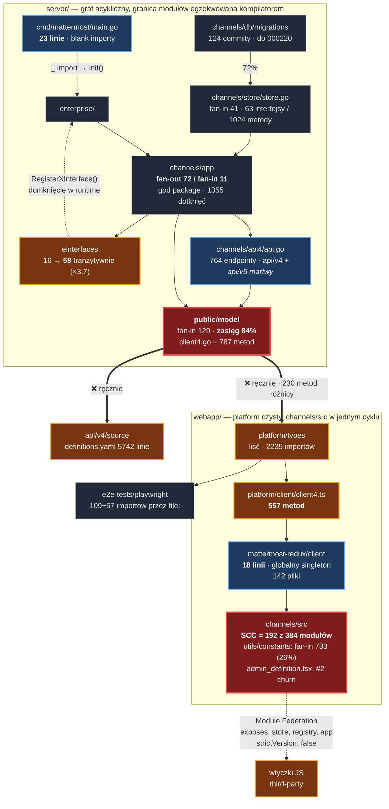

# Mapa projektu — mattermost

**HEAD** `87168644a4` · **okno** 6 mies. (terytorium, struktura) / 12 mies. (kontrybutorzy) · **stan na** 2026-09-10
**Źródła:** [Artefakt 1 — terytorium](artifact-1-territory.md) · [Artefakt 2 — struktura](artifact-2-structure.md) · [Artefakt 3 — kontrybutorzy](artifact-3-contributors.md)

Mapa jest warstwą decyzyjną, nie opisem repo. Każde twierdzenie ma liczbę i źródło.

---

## 1. Pięć rzeczy, które trzeba wiedzieć

| # | Wniosek | Dowód |
|---|---|---|
| 1 | **`server/public/model` to centrum całego repo** — nie `channels/app` | fan-in 129, zasięg tranzytywny **84%** ze 164 pakietów; jego lustro `@mattermost/types` ma 2235 importów w webappie — więcej niż `react` (2101) |
| 2 | **Kontrakt REST istnieje w 3 ręcznie pisanych kopiach i jest mierzalnie rozjechany** | `client4.go` = **787 metod**, `client4.ts` = **557**; brak generatora Go→TS; tylko **34%** zmian `client4.go` propaguje się do wszystkich kopii, **30% do żadnej** |
| 3 | **Repo ma dwie różne architektury** — nie stosuj do nich tych samych reguł | Go: **0 cykli**, twarda granica modułów (0 krawędzi `public/`→`v8/`). Webapp `channels/src`: **SCC = 192 z 384 modułów (50%)**, 82 pary dwukierunkowe |
| 4 | **Najgorętszy obszar produktowy to ABAC** i jest jeszcze niedomknięty | 655 dotknięć / 125 commitów; migracje schematu do `000220` w ostatnich tygodniach; pełny przekrój store→app→api4→admin UI→E2E |
| 5 | **Krytyczne obszary nie mają właściciela** | `CODEOWNERS` = 19 linii; pokrywa strony changelogu w docs, **nie pokrywa** `public/model`, `platform/types` ani `api/v4/source` |

---

## 2. Diagram

**Legenda:** `══>` kontrakt utrzymywany ręcznie (brak narzędzia) · `-.->` krawędź runtime, niewidoczna dla kompilatora i dla grafu importów · 🔴 centrum · 🔵 cienkie wejście · 🟠 ryzyko

---

## 3. Strefy — gdzie jest gorąco, gdzie zimno

| Strefa | Aktywność 6m | Struktura | Właściciel |
|---|---|---|---|
| `server/public/model` | 718 dotknięć | fan-in 129, zasięg 84% | ❌ brak |
| `server/channels/app` | 1355 (nr 1) | fan-out 72 / fan-in 11 | ❌ brak |
| `webapp/.../admin_console` | 1040, **×1,9 kw/kw** | fan-out 70, w SCC | ❌ brak |
| klaster ABAC | 655 / 125 commitów | przekrój wszystkich warstw | 🟡 de facto 2 osoby |
| `e2e-tests/playwright` | 1041, **×2,5 kw/kw** | 88% plików tkniętych | — |
| `api/v4/source` | 102, **trend ▼▼** | 3. kopia kontraktu | ❌ brak |
| `webapp/platform/*` | 297 | ✅ acykliczny, warstwowy | — |
| `server/public/plugin` | 264 | ✅ generator + `plugin-checker` w CI | ✅ narzędzie |
| **`e2e-tests/cypress`** | 131, ale **15% plików** | 31 usuniętych vs 9 dodanych | 🪦 wygaszany |
| 2/3 `channels/src/components` | ~2700 plików nietkniętych | zimne wyspy | — |

---

## 4. Reguły blast radius — co sprawdzić przy zmianie

| Zmieniasz | Pęknie od razu | **Pęknie cicho** |
|---|---|---|
| `public/model/*.go` | 129 pakietów Go (84%) | `platform/types`, `client4.ts`, `api/v4/*.yaml`, wtyczki JS ze starą kopią typów |
| `public/model/client4.go` | — | **historycznie 30% takich zmian nie trafiło nigdzie indziej** |
| `channels/store/store.go` | 41 pakietów | `timerlayer`, `retrylayer`, mocki → `make store-layers` |
| `einterfaces/*.go` | 16 pakietów | **59 tranzytywnie**, w tym całe `enterprise/` — wykryjesz dopiero przy buildzie enterprise |
| `platform/types/src/*.ts` | webapp (2235 importów) | **`e2e-tests/playwright`** — linkuje przez `file:` |
| `platform/client/src/client4.ts` | 31 importów | **142 pliki** przez singleton `mattermost-redux/client` |
| `utils/constants.tsx` | 733 pliki (26% webappu) | wszystko w SCC-192 |
| `stores/redux_store`, `module_registry`, `components/app` | kilka plików | **wtyczki third-party** przez Module Federation — zero sygnału w CI |
| `admin_definition.tsx` | — | konflikty merge; #2 churn w repo, każdy feature z ustawieniem przez niego przechodzi |
| cokolwiek w `channels/src` | — | blast radius **nieobliczalny** w SCC-192 — polegaj na testach, nie na grafie |

---

## 5. Ryzyka — uszeregowane

### 🔴 1. Rozjazd kontraktu REST — luka narzędziowa, nie luka wiedzy

787 vs 557 metod. Trzy kopie, zero generatora, zero checkera, **zero commitów typu
„sync spec" w 12 miesięcy**. Pełną 3-stronną synchronizację zrobiło 19 różnych osób,
rekordzista 5 razy w roku.

**Dowód, że da się inaczej — w tym samym repo:** kontrakt wtyczek ma `make pluginapi`
(generator) + `plugin-checker` wpięty w `check-style`. Dokumentacja ma nazwaną kampanię
uzgadniania rozjazdu (`docs(P13)`/`P14`/`P15`). Kontrakt REST nie ma ani jednego, ani drugiego.

**Działanie:** generator albo checker w CI. Nie proces, nie dokumentacja — 41% kontrybutorów
repo przechodzi tędy rocznie i żaden przegląd tego nie utrzyma.

### 🔴 2. ABAC — praca w toku, wysokie ryzyko kolizji + bus factor 2

655 dotknięć, migracje schematu do ostatnich tygodni okna, przekrój wszystkich warstw.
Jednocześnie `app/access_control.go`: **9 autorów, top3 = 75%, bus factor 2**.

**Działanie:** przed zmianą dotykającą uprawnień — sprawdź, co jest w locie. To najbardziej
skoncentrowana wiedza w repo i najbardziej ruchomy grunt naraz.

### 🟠 3. Krawędzie runtime niewidoczne dla CI

Cztery moduły `channels/src` są de facto publicznym API dla wtyczek (Module Federation
`exposes`), a `@mattermost/types` jest tam współdzielone z `strictVersion: false` —
skew wersji przechodzi bez ostrzeżenia. Po stronie Go: `enterprise/` wpina się przez
rejestr runtime i blank import w 23-linijkowym `main.go`.

**Działanie:** przy zmianie `stores/redux_store`, `module_registry`, `components/app`
albo `einterfaces/*` nie ufaj zielonemu CI.

### 🟡 4. Rosnący udział agenta AI bez śladu autorstwa

`cursor[bot]` w strefie kontraktu: **1 commit → 23** między kwartałami (135 w repo w 12 mies.).
Współautor to konto serwisowe `mattermost-code`, nie osoba. Dla rosnącej części zmian
`git log` nie wskaże człowieka do zapytania.

---

## 6. Kogo pytać

| Temat | Osoba | Podstawa |
|---|---|---|
| powierzchnia REST / `Client4` | **Ben Schumacher** | 46% pracy w strefie kontraktu; autor przepisania klienta Go na generyki (`#31805`) |
| dyscyplina propagacji kontraktu | **Harshil Sharma** | 5 z 17 pełnych 3-stronnych synchronizacji — ⚠️ aktywność spadła 14 → 2 kw/kw |
| konfiguracja, cykl życia flag | **Jesse Hallam** | 50 commitów w strefie, najbardziej aktywny obecnie; specjalizacja „graduate X out of Experimental" |
| ABAC / atrybuty | **Pablo Vélez, Nick Misasi, Devin Binnie, Ibrahim Serdar Acikgoz** | cztery warstwy tej samej inicjatywy |
| auth | `@mattermost/product-security` | jedyny zespołowy wpis w `CODEOWNERS` |

⚠️ Historia gita nie pokazuje recenzentów (squash merge przez GitHuba) — pełny obraz wymaga GitHub API.

---

## 7. Lektura przed pierwszą zmianą

| Co | Dlaczego |
|---|---|
| `#31805` Rewrite Go client using Generics | zmienia sposób pisania każdej nowej metody `Client4` |
| `#34499` New way to build routes in Client4 | nowa konwencja; starsze przykłady w kodzie nieaktualne |
| `#37882`, `#37809`, `#33765` (Harshil Sharma) | jedyne dobre wzorce pełnej synchronizacji kontraktu |
| `#38382` + fala v12.0 (`#38174`, `#37743`, `#37759`, `#37999`, `#37163`) | co właśnie wypada z kontraktu |
| `#38296` MM-69882 | wzorzec obrony przed cichym rozjazdem: asercja liczby pól w `PostPatch.IsEmpty` |
| `#37045` | edge case: panic przy `options == nil` — klasa błędu do sprawdzenia w podobnych metodach |

---

## 8. Czego mapa nie mówi

- **Nie czytano kodu.** Wszystko pochodzi z historii gita i statycznej analizy importów
  własnym parserem (`go` nie było w PATH, `node_modules` niezainstalowane — `go list`,
  `madge` i `dependency-cruiser` niedostępne).
- **Nie zmierzono jakości ani rozmiaru zmian** — churn liczy dotknięcia, fan-in liczy
  moduły, nie wywołania.
- **Testy wykluczono z grafu**; 17 commitów mechanicznych wykluczono z churnu (decyzja arbitralna).
- **Recenzenci PR-ów są niewidoczni** — najlepsze źródło wiedzy o obszarze pozostaje nieużyte.
- **`api/v5` to placeholder z 2023** (2 odwołania, zero aktywności) — nie ścieżka migracji.
